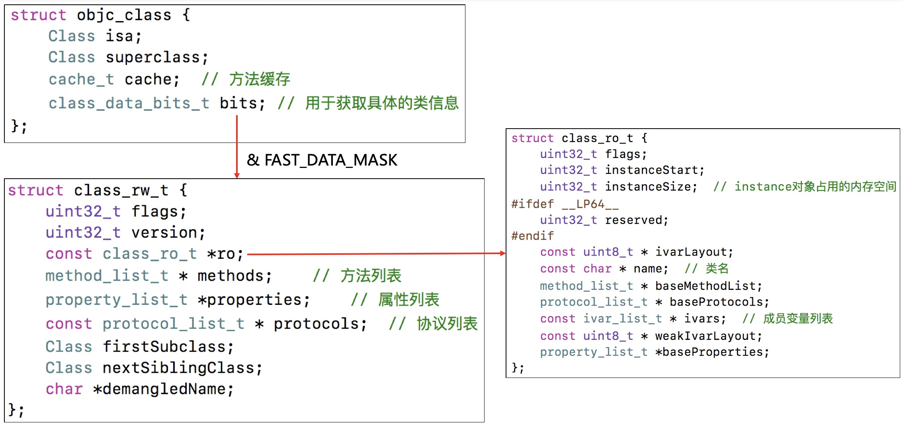
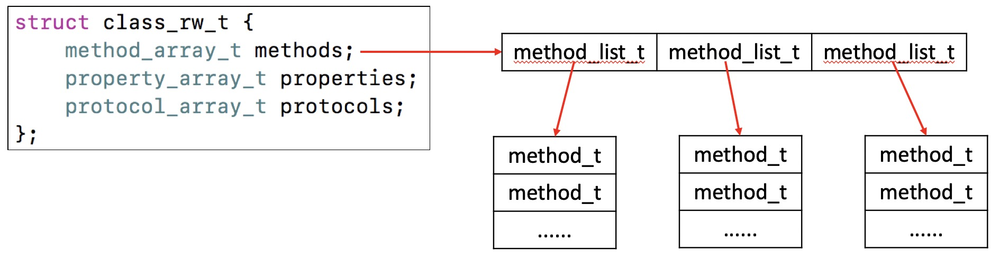
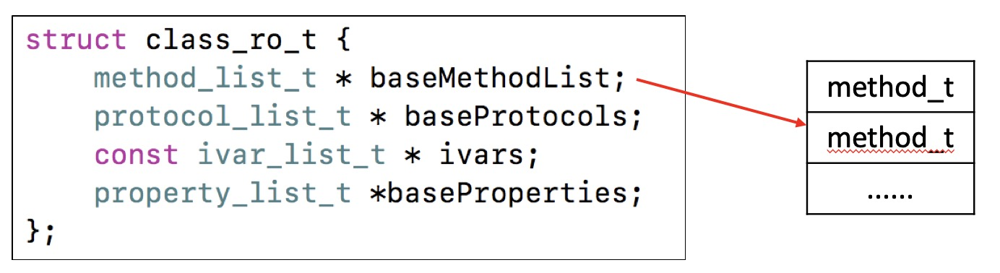
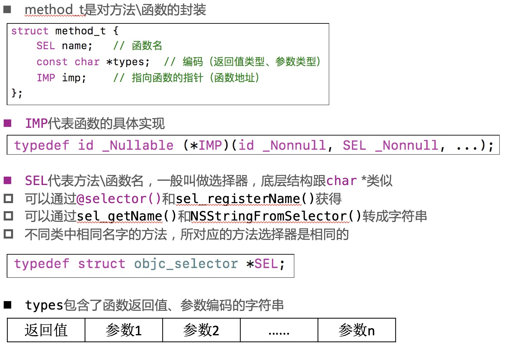
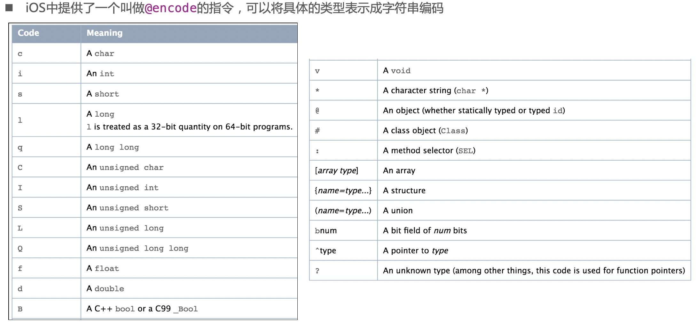
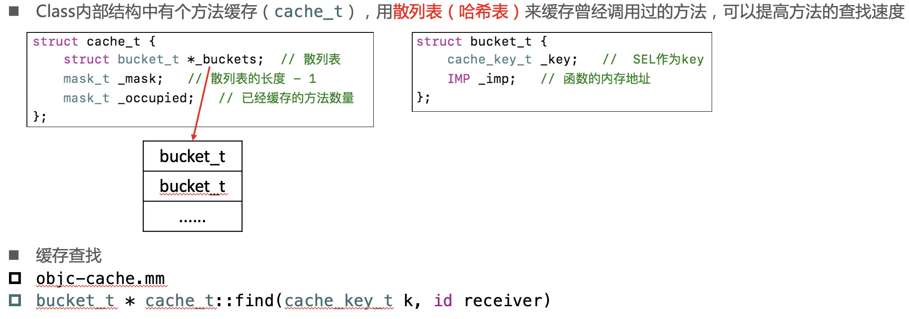
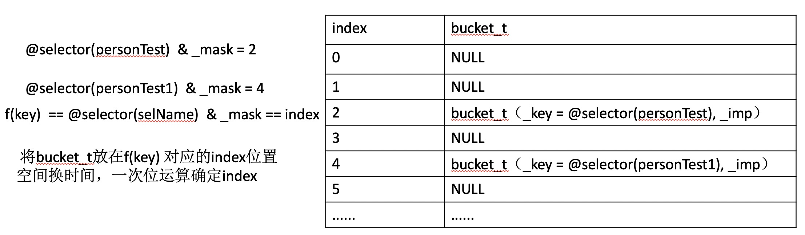
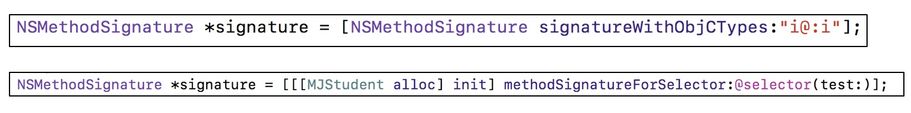

# 8、Runtime
* Objective-C是一门动态性比较强的编程语言，跟C、C++等语言有着很大的不同
* Objective-C的动态性是由Runtime API来支撑的
* Runtime API提供的接口基本都是C语言的，源码由C\C++\汇编语言编写

## 8.1 isa详解

### 8.1.1 isa简介

* 要想学习Runtime，首先要了解它底层的一些常用数据结构，比如isa指针
* 在arm64架构之前，isa就是一个普通的指针，存储着Class、Meta-Class对象的内存地址
* 从arm64架构开始，对isa进行了优化，变成了一个共用体（union）结构，还使用位域来存储更多的信息。需要用isa & ISA_MASK才能找到类，元类。


为了达到节省空间的目的，可以通过以下方式。

* 用位运算，一个char可以存储8个bool变量。

```
@interface MJPerson : NSObject
//@property (assign, nonatomic, getter=isTall) BOOL tall;
//@property (assign, nonatomic, getter=isRich) BOOL rich;
//@property (assign, nonatomic, getter=isHansome) BOOL handsome;

- (void)setTall:(BOOL)tall;
- (void)setRich:(BOOL)rich;
- (void)setHandsome:(BOOL)handsome;

- (BOOL)isTall;
- (BOOL)isRich;
- (BOOL)isHandsome;

@end

// &可以用来取出特定的位

// 0000 0111
//&0000 0100
//------
// 0000 0100

// 掩码，一般用来按位与(&)运算的
//#define MJTallMask 1
//#define MJRichMask 2
//#define MJHandsomeMask 4

//#define MJTallMask 0b00000001
//#define MJRichMask 0b00000010
//#define MJHandsomeMask 0b00000100

//用位移运算符优化的掩码
#define MJTallMask (1<<0)
#define MJRichMask (1<<1)
#define MJHandsomeMask (1<<2)

@interface MJPerson()
{
    char _tallRichHansome;
}
@end

@implementation MJPerson


// 0010 1010
//&1111 1101
//----------
// 0010 1000

- (instancetype)init
{
    if (self = [super init]) {
        _tallRichHansome = 0b00000100;
    }
    return self;
}

- (void)setTall:(BOOL)tall
{
    if (tall) {
        //如果某位想设置为1只需要将该位|1，这位设置成1。
        _tallRichHansome |= MJTallMask;
    } else {
        //如果某位想设置为0只需要将该位&0，这位设置成0。~为按位取反。
        _tallRichHansome &= ~MJTallMask;
    }
}

/*
把用的那一位用 &1 取出
只要&出有值，肯定不为0
!(_tallRichHansome & MJTallMask)将char转成bool，取反。
!！(_tallRichHansome & MJTallMask)为转换成相应的bool值。
**/

- (BOOL)isTall
{
    return !!(_tallRichHansome & MJTallMask);
}

- (void)setRich:(BOOL)rich
{
    if (rich) {
        _tallRichHansome |= MJRichMask;
    } else {
        _tallRichHansome &= ~MJRichMask;
    }
}

- (BOOL)isRich
{
    return !!(_tallRichHansome & MJRichMask);
}

- (void)setHandsome:(BOOL)handsome
{
    if (handsome) {
        _tallRichHansome |= MJHandsomeMask;
    } else {
        _tallRichHansome &= ~MJHandsomeMask;
    }
}

- (BOOL)isHandsome
{
    return !!(_tallRichHansome & MJHandsomeMask);
}

@end
```

* 位域

```
@interface MJPerson : NSObject
- (void)setTall:(BOOL)tall;
- (void)setRich:(BOOL)rich;
- (void)setHandsome:(BOOL)handsome;

- (BOOL)isTall;
- (BOOL)isRich;
- (BOOL)isHandsome;
@end

@interface MJPerson()
{
    // 位域
    struct {
        char tall : 1;
        char rich : 1;
        char handsome : 1;
    } _tallRichHandsome;
    /* 
    0b00000000 tall为右边第一位，rich为右边第二位，handsome为右边第三位。
    char tall : 2;
    char rich : 2;
    char handsome : 2;
    如果都改成2，则isTall可改为
    - (BOOL)isTall
    {
        return _tallRichHandsome.tall;
    }
    如果 char tall : 1;像上面那样写，会将最后一位填充到前面变成0b1111 1111 为-1。char tall : 2；两位表示bool 用0b01的高位0填充变成 0b0000 0001为yes。
    **/
}
@end

@implementation MJPerson

- (void)setTall:(BOOL)tall
{
    _tallRichHandsome.tall = tall;
}

- (BOOL)isTall
{
    //将char转成bool
    return !!_tallRichHandsome.tall;
}

- (void)setRich:(BOOL)rich
{
    _tallRichHandsome.rich = rich;
}

- (BOOL)isRich
{
    return !!_tallRichHandsome.rich;
}

- (void)setHandsome:(BOOL)handsome
{
    _tallRichHandsome.handsome = handsome;
}

- (BOOL)isHandsome
{
    return !!_tallRichHandsome.handsome;
}

int main () {
      MJPerson *person = [[MJPerson alloc] init];
        person.rich = YES;
        person.tall = NO;
        person.handsome = NO;
        
        NSLog(@"tall:%d rich:%d hansome:%d", person.isTall, person.isRich, person.isHandsome);
}
lldb
p/x persion->_tallRichHandsome
p/x &(persion->_tallRichHandsome)
x 上面的地址
```

* 共用体

```
#import <Foundation/Foundation.h>
@interface MJPerson : NSObject
- (void)setTall:(BOOL)tall;
- (void)setRich:(BOOL)rich;
- (void)setHandsome:(BOOL)handsome;
- (void)setThin:(BOOL)thin;

- (BOOL)isTall;
- (BOOL)isRich;
- (BOOL)isHandsome;
- (BOOL)isThin;
@end

#import "MJPerson.h"

#define MJTallMask (1<<0)
#define MJRichMask (1<<1)
#define MJHandsomeMask (1<<2)
#define MJThinMask (1<<3)

@interface MJPerson()
{
    //共用体，共用一块内存。（bits和_tallRichHandsome共用一块内存）
    union {
        char bits;
        //和第一种方式相同。结构体只是为了增加代码的可读性，可以删除。
        //如果结构体的大小大于8bit，则bits需要改为更长的类型，如int。以免越界丢失
        struct {
            char tall : 1;
            char rich : 1;
            char handsome : 1;
            char thin : 1;
        };
    } _tallRichHandsome;
}
@end

@implementation MJPerson

- (void)setTall:(BOOL)tall
{
    if (tall) {
        _tallRichHandsome.bits |= MJTallMask;
    } else {
        _tallRichHandsome.bits &= ~MJTallMask;
    }
}

- (BOOL)isTall
{
    return !!(_tallRichHandsome.bits & MJTallMask);
}

- (void)setRich:(BOOL)rich
{
    if (rich) {
        _tallRichHandsome.bits |= MJRichMask;
    } else {
        _tallRichHandsome.bits &= ~MJRichMask;
    }
}

- (BOOL)isRich
{
    return !!(_tallRichHandsome.bits & MJRichMask);
}

- (void)setHandsome:(BOOL)handsome
{
    if (handsome) {
        _tallRichHandsome.bits |= MJHandsomeMask;
    } else {
        _tallRichHandsome.bits &= ~MJHandsomeMask;
    }
}

- (BOOL)isHandsome
{
    return !!(_tallRichHandsome.bits & MJHandsomeMask);
}

- (void)setThin:(BOOL)thin
{
    if (thin) {
        _tallRichHandsome.bits |= MJThinMask;
    } else {
        _tallRichHandsome.bits &= ~MJThinMask;
    }
}

- (BOOL)isThin
{
    return !!(_tallRichHandsome.bits & MJThinMask);
}

@end

* 相关技术点，NS_OPTIONS枚举实现原理

```
typedef enum {
    MJOptionsOne = 1 << 0,
    MJOptionsTwo = 1 << 1,
    MJOptionsThree = 1 << 2,
    MJOptionsFour = 1 << 3,
} MJOptions;

- (int)main {
    [self setOptions:MJOptionsOne | MJOptionsTwo | MJOptionsThree | MJOptionsFour];
}

- (void)setOptions:(MJOptions)options {
    if (options & MJOptionsOne) {
        NSLog(@"包含MJOptionsOne");
    }
    if (options & MJOptionsTwo) {
        NSLog(@"包含MJOptionsTwo");
    }
    if (options & MJOptionsThree) {
        NSLog(@"包含MJOptionsThree");
    }
    if (options & MJOptionsFour) {
        NSLog(@"包含MJOptionsFour");
    }
}
```

```

### 8.1.2 isa位域

p/x obj->isa可以查看每一位

* nonpointer
    * 0，代表普通的指针，存储着Class、Meta-Class对象的内存地址
    * 1，代表优化过，使用位域存储更多的信息
* has_assoc
    * 是否有设置过关联对象，如果没有，释放时会更快，如果有需要先移除关联对象。（objc-runtime-new.mm中objc_destructInstance函数中有源码）
* has_cxx_dtor
    * 是否有C++的析构函数（.cxx_destruct），如果没有，释放时会更快，如果有，需要先调用析构函数。（objc-runtime-new.mm中objc_destructInstance函数中有源码）
* shiftcls
    * 存储着Class、Meta-Class对象的内存地址信息
    * Class、Meta-Class对象的内存地址值最后三位永远是0（shiftcls右边有上面三位的信息，&ISA_MASK后三位为0，使用位域，先用的是最右边的位）
* magic
    * 用于在调试时分辨对象是否未完成初始化
* weakly_referenced
    * 是否有被弱引用指向过，如果没有，释放时会更快
* deallocating
    * 对象是否正在释放
* extra_rc
    * 里面存储的值是引用计数器减1
* has_sidetable_rc
    * 引用计数器是否过大无法存储在isa中
    * 如果为1，那么引用计数会存储在一个叫SideTable的类的属性中

## 8.2 Class

### 8.2.1 Class的结构




[MJClassInfo.h](project/MJClassInfo.h)

* bits和isa相似，存储了很多信息。
* MJClassInfo为了方便理解进行了简化，methods等是一维数组，真实类型为下面的二维数组。


### 8.2.2 class_rw_t

* class_rw_t里面的methods、properties、protocols是二维数组，是可读可写的，包含了类的初始内容、分类的内容。可以动态添加分类。



### 8.2.3 class_ro_t

* class_ro_t里面的baseMethodList、baseProtocols、ivars、baseProperties是一维数组，是只读的，包含了类的初始内容



### 8.2.4 method_t



### 8.2.5 Type Encoding



```
NSLog(@"%s", @encode(int));//输出 i 表示int
NSLog(@"%s", @encode(id));//输出 @ 表示 an obj or id type

/*
 "i24@0:8i16f20"
 "i 24 @ 0 : 8 i 16 f 20"
 i表示返回类型int，24 所有参数是字节数，@表示self，0表示重0开始，:表示参数 _cmd，8表示起始位置，i表示age的参数类型int，16表示起始位置，f表示height的参数类型float，20表示起始位置。
 **/
- (int)test:(int)age height:(float)height;
```

### 8.2.6 方法缓存




* @selector(selName) & _mask <= _mask,所以_mask为散列表的长度-1，（下标从0开始）
* 算法详情见MJClassInfo.h中cache_t结构体的方法 IMP imp(SEL selector)中的实现。如果一直没有找到合适的index。会将_buckets清空，将_mask翻倍，重新进行缓存计算。
* 通过MJClassInfo.h查看Cache_t

```
MJClassInfo.h为c++代码。使用步骤
1、将MJClassInfo.h添加到工程中。
2、将用到的类的.m修改成.mm。（为了支持c++语法）
3、强制转换类型
MJPerson *person = [[MJPerson alloc] init];
mj_objc_class *personClass = (__bridge mj_objc_class *)[MJPerson class];
[person test1];
[person test2];
[person test3];
[person test4];
4、打断点，每调用一个方法，查看personClass结构。cache数组只能显示第一个位置的信息，有可能为空。计算出来的index可能不是第0个位置。
如果想查看cache数据的所有数据。
bucket_t *buckets = cache._buckets;

//bucket_t bucket = buckets[(long long)@selector(studentTest) & cache._mask];
//NSLog(@"%s %p", bucket._key, bucket._imp);
//有可能第一次算出来的index不是我们想取的方法。调用MJClassInfo.h中cache_t结构体的方法 IMP imp(SEL selector)能保证取出来的index是想要的。
        
for (int i = 0; i <= cache._mask; i++) {
    bucket_t bucket = buckets[i];
    NSLog(@"%s %p", bucket._key, bucket._imp);
}

lldb
//可以查看方法。
p (IMP)(上面log出来的imp地址)
(lldb)p (IMP)0x100000e00 
(IMP) $0 = 0x100000e00 (Interview01-cache`-[MJPerson personTest] at MJPerson.m:12)
//Interview01-cache为工程名，-[MJPerson personTest] at MJPerson.m:12，方法位置。
```

## 8.3 objc_msgSend

>sel_registerName("test")等价于@selector(test)
>c语言转汇编会在方法名称前加一个_

### 8.3.1 执行流程

* OC中的方法调用，其实都是转换为objc_msgSend函数的调用
* objc_msgSend的执行流程可以分为3大阶段
  * 消息发送
  * 动态方法解析
  * 消息转发

### 8.3.2 源码跟读

* objc-msg-arm64.s
  * ENTRY _objc_msgSend
  * b.le	LNilOrTagged
  * CacheLookup NORMAL
  * .macro CacheLookup
  * .macro CheckMiss
  * STATIC_ENTRY __objc_msgSend_uncached
  * .macro MethodTableLookup
  * __class_lookupMethodAndLoadCache3

* objc-runtime-new.mm
  * _class_lookupMethodAndLoadCache3
  * lookUpImpOrForward
  * getMethodNoSuper_nolock、search_method_list、log_and_fill_cache
  * cache_getImp、log_and_fill_cache、getMethodNoSuper_nolock、log_and_fill_cache
  * _class_resolveInstanceMethod
  * _objc_msgForward_impcache

* objc-msg-arm64.s
  * STATIC_ENTRY __objc_msgForward_impcache
  * ENTRY __objc_msgForward

* Core Foundation
  * \_\_forwarding__（不开源）

### 8.3.3 消息发送


### 8.3.4 动态方法解析


* 动态添加方法


```
@interface MJPerson : NSObject
//- (void)test;
+ (void)test;
@end

#import "MJPerson.h"
#import <objc/runtime.h>

@implementation MJPerson

//void c_other(id self, SEL _cmd)
//{
//    NSLog(@"c_other - %@ - %@", self, NSStringFromSelector(_cmd));
//}
//
//+ (BOOL)resolveClassMethod:(SEL)sel
//{
//    if (sel == @selector(test)) {
//        // 第一个参数是object_getClass(self)
//        class_addMethod(object_getClass(self), sel, (IMP)c_other, "v16@0:8");
//        return YES;
//    }
//    return [super resolveClassMethod:sel];
//}

//+ (BOOL)resolveInstanceMethod:(SEL)sel
//{
//    if (sel == @selector(test)) {
//        // 动态添加test方法的实现
//        class_addMethod(self, sel, (IMP)c_other, "v16@0:8");
//
//        // 返回YES代表有动态添加方法
//        return YES;
//    }
//    return [super resolveInstanceMethod:sel];
//}

//- (void)other
//{
//    NSLog(@"%s", __func__);
//}
//
//+ (BOOL)resolveInstanceMethod:(SEL)sel
//{
//    if (sel == @selector(test)) {
//        // 获取其他方法
//        Method method = class_getInstanceMethod(self, @selector(other));
//
//        // 动态添加test方法的实现
//        class_addMethod(self, sel,
//                        method_getImplementation(method),
//                        method_getTypeEncoding(method));
//
//        // 返回YES代表有动态添加方法
//        return YES;
//    }
//    return [super resolveInstanceMethod:sel];
//}

// typedef struct objc_method *Method;
// struct objc_method == struct method_t
//        struct method_t *otherMethod = (struct method_t *)class_getInstanceMethod(self, @selector(other));

struct method_t {
    SEL sel;
    char *types;
    IMP imp;
};

//+ (BOOL)resolveInstanceMethod:(SEL)sel
//{
//    if (sel == @selector(test)) {
//        // 获取其他方法
//        struct method_t *method = (struct method_t *)class_getInstanceMethod(self, @selector(other));
//
//        // 动态添加test方法的实现
//        class_addMethod(self, sel, method->imp, method->types);
//
//        // 返回YES代表有动态添加方法
//        return YES;
//    }
//    return [super resolveInstanceMethod:sel];
//}
```

### 8.3.5 消息转发

来到消息转发会调用函数\_\_forwarding__，内部会调用下图中的方法，\_\_forwarding__未开源，国外根据汇编写的伪代码如下
原版
[\_\_forwarding__.c](project/__forwarding__.c)
删除部分逻辑的精简版
[\_\_forwarding__clean.c](project/__forwarding__clean.c)


* 生成NSMethodSignature



```
@interface MJPerson : NSObject
- (void)test;
@end
#import "MJPerson.h"
#import <objc/runtime.h>
#import "MJCat.h"

@implementation MJPerson

//- (id)forwardingTargetForSelector:(SEL)aSelector
//{
//    if (aSelector == @selector(test)) {
//        // objc_msgSend([[MJCat alloc] init], aSelector)
//        return [[MJCat alloc] init];
//    }
//    return [super forwardingTargetForSelector:aSelector];
//}

// 方法签名：返回值类型、参数类型
//- (NSMethodSignature *)methodSignatureForSelector:(SEL)aSelector
//{
//    if (aSelector == @selector(test)) {
//        return [NSMethodSignature signatureWithObjCTypes:"v16@0:8"];
//    }
//    return [super methodSignatureForSelector:aSelector];
//}

// NSInvocation封装了一个方法调用，包括：方法调用者、方法名、方法参数
//    anInvocation.target 方法调用者
//    anInvocation.selector 方法名
//    [anInvocation getArgument:NULL atIndex:0]
//- (void)forwardInvocation:(NSInvocation *)anInvocation
//{
////    anInvocation.target = [[MJCat alloc] init];
////    [anInvocation invoke];
//
//    [anInvocation invokeWithTarget:[[MJCat alloc] init]];
//}

@end

@interface MJCat : NSObject
- (void)test;
@end

#import "MJCat.h"

@implementation MJCat
- (void)test
{
    NSLog(@"%s", __func__);
}
@end
```

```
@interface MJPerson : NSObject
- (int)test:(int)age;
@end

#import <objc/runtime.h>
#import "MJCat.h"

@implementation MJPerson

- (NSMethodSignature *)methodSignatureForSelector:(SEL)aSelector
{
    if (aSelector == @selector(test:)) {
//        return [NSMethodSignature signatureWithObjCTypes:"v20@0:8i16"];
//省略大小，直接写类型
        return [NSMethodSignature signatureWithObjCTypes:"i@:i"];
//        return [[[MJCat alloc] init] methodSignatureForSelector:aSelector];
    }
    return [super methodSignatureForSelector:aSelector];
}

// 如果能来到forwardInvocation，里面想干什么就干什么，比如只是NSLog，而不对anInvocation进行处理。调用的方法就是forwardInvocation中写的东西。
- (void)forwardInvocation:(NSInvocation *)anInvocation
{
    // 参数顺序：receiver、selector、other arguments
//    int age;
//    [anInvocation getArgument:&age atIndex:2];
//    NSLog(@"%d", age + 10);
    
    
    // anInvocation.target == [[MJCat alloc] init]
    // anInvocation.selector == test:
    // anInvocation的参数：15
    // [[[MJCat alloc] init] test:15]
    
    [anInvocation invokeWithTarget:[[MJCat alloc] init]];
    
    int ret;
    [anInvocation getReturnValue:&ret];
    
    NSLog(@"%d", ret);
}

@interface MJCat : NSObject
- (int)test:(int)age;
@end

#import "MJCat.h"

@implementation MJCat
- (int)test:(int)age
{
    return age * 2;
}
@end

int main(int argc, const char * argv[]) {
    @autoreleasepool {
        MJPerson *person = [[MJPerson alloc] init];
        [person test:15];
    }
    return 0;
}
```

```
@interface MJPerson : NSObject
+ (void)test;
@end

#import <objc/runtime.h>
#import "MJCat.h"

@implementation MJPerson

+ (id)forwardingTargetForSelector:(SEL)aSelector
{

    //objc_msgSend看receiver是什么类型，所以这里+、-方法都可以调。
    //if (aSelector == @selector(test)) return [MJCat class];
    // objc_msgSend([[MJCat alloc] init], @selector(test))
    // [[[MJCat alloc] init] test]
    if (aSelector == @selector(test)) return [[MJCat alloc] init];

    return [super forwardingTargetForSelector:aSelector];
}

//+ (NSMethodSignature *)methodSignatureForSelector:(SEL)aSelector
//{
//    if (aSelector == @selector(test)) return [NSMethodSignature signatureWithObjCTypes:"v@:"];
//    
//    return [super methodSignatureForSelector:aSelector];
//}
//
//+ (void)forwardInvocation:(NSInvocation *)anInvocation
//{
//    NSLog(@"1123");
//}

@end

@interface MJCat : NSObject
+ (void)test;
- (void)test;
@end

#import "MJCat.h"

@implementation MJCat

+ (void)test
{
    NSLog(@"%s", __func__);
}

- (void)test
{
    NSLog(@"%s", __func__);
}

@end

// 消息转发：将消息转发给别人
// 元类对象是一种特殊的类对象
int main(int argc, const char * argv[]) {
    @autoreleasepool {
        [MJPerson test];
    }
    return 0;
}
```

```
@interface MJPerson : NSObject
- (void)run;
- (void)test;
- (void)other;
@end

#import "MJPerson.h"

@implementation MJPerson

- (void)run
{
    NSLog(@"run-123");
}

- (NSMethodSignature *)methodSignatureForSelector:(SEL)aSelector
{
    // 本来能调用的方法
    if ([self respondsToSelector:aSelector]) {
        return [super methodSignatureForSelector:aSelector];
    }
    
    // 找不到的方法
    return [NSMethodSignature signatureWithObjCTypes:"v@:"];
}

// 找不到的方法，都会来到这里
- (void)forwardInvocation:(NSInvocation *)anInvocation
{
    NSLog(@"找不到%@方法", NSStringFromSelector(anInvocation.selector));
}
@end

// NSProxy

int main(int argc, const char * argv[]) {
    @autoreleasepool {
        MJPerson *person = [[MJPerson alloc] init];
        //处理MJPerson未实现的方法
        [person run];
        [person test];
        [person other];
    }
    return 0;
}
```


## 8.4 super

### 8.4.1 super的本质
* super调用，底层会转换为objc_msgSendSuper2函数的调用，接收2个参数
  * struct objc_super2
  * SEL

```
struct objc_super2 {
    id receiver;
    Class current_class;
};
```

>通过汇编可以看到，和clang转的c++代码objc_msgSendSuper有区别
>objc_megSendSuper({self, class_getSuperclass(objc_getClass("MJStudent"))}, sel_registerName("class"))
>objc_msgSendSuper2的第一个参数结构体是将当前类传进去，内部找到superclass

* receiver是消息接收者
* current_class是receiver的Class对象

```
MJStudent继承于MJPerson
NSLog(@"[self class] = %@", [self class]); // MJStudent
NSLog(@"[self superclass] = %@", [self superclass]); // MJPerson

NSLog(@"--------------------------------");

/*
objc_megSendSuper({self, class_getSuperclass(objc_getClass("MJStudent"))}, sel_registerName("class"))
// objc_msgSendSuper({self, [MJPerson class]}, @selector(class));
class在NSObject中，class的底层实现
@implementation NSObject

- (Class)class {
    return object_getClass(self);
}

所以NSLog(@"[super class] = %@", [super class]); 输出 MJStudent
[super message]的底层实现
1.消息接收者仍然是子类对象
2.从父类开始查找方法的实现

@end
*/
NSLog(@"[super class] = %@", [super class]); // MJStudent

/*
- (Class)superclass {
    return class_getSuperclass(object_getClass(self));
}
**/
NSLog(@"[super superclass] = %@", [super superclass]); // MJPerson
```

```
#import <objc/runtime.h>

//@implementation NSObject
//
//- (BOOL)isMemberOfClass:(Class)cls {
//    return [self class] == cls;
//}
//
//- (BOOL)isKindOfClass:(Class)cls {
//    for (Class tcls = [self class]; tcls; tcls = tcls->superclass) {
//        if (tcls == cls) return YES;
//    }
//    return NO;
//}
//
//
//+ (BOOL)isMemberOfClass:(Class)cls {
//    return object_getClass((id)self) == cls;
//}
//
//
//+ (BOOL)isKindOfClass:(Class)cls {
//    for (Class tcls = object_getClass((id)self); tcls; tcls = tcls->superclass) {
//        if (tcls == cls) return YES;
//    }
//    return NO;
//}
//@end

int main(int argc, const char * argv[]) {
    @autoreleasepool {
//        NSLog(@"%d", [[NSObject class] isKindOfClass:[NSObject class]]);
//        NSLog(@"%d", [[NSObject class] isMemberOfClass:[NSObject class]]);
//        NSLog(@"%d", [[MJPerson class] isKindOfClass:[MJPerson class]]);
//        NSLog(@"%d", [[MJPerson class] isMemberOfClass:[MJPerson class]]);
        
        
        // 这句代码的方法调用者不管是哪个类（只要是NSObject体系下的），都返回YES
        NSLog(@"%d", [NSObject isKindOfClass:[NSObject class]]); // 1
        NSLog(@"%d", [NSObject isMemberOfClass:[NSObject class]]); // 0
        NSLog(@"%d", [MJPerson isKindOfClass:[MJPerson class]]); // 0
        NSLog(@"%d", [MJPerson isMemberOfClass:[MJPerson class]]); // 0
        
        
//        id person = [[MJPerson alloc] init];
        
//        NSLog(@"%d", [person isMemberOfClass:[MJPerson class]]);
//        NSLog(@"%d", [person isMemberOfClass:[NSObject class]]);
        
//        NSLog(@"%d", [person isKindOfClass:[MJPerson class]]);
//        NSLog(@"%d", [person isKindOfClass:[NSObject class]]);
        
        
//        NSLog(@"%d", [MJPerson isMemberOfClass:object_getClass([MJPerson class])]);
//        NSLog(@"%d", [MJPerson isKindOfClass:object_getClass([NSObject class])]);
        
        //基类的元类对象的supperclass就是基类
//        NSLog(@"%d", [MJPerson isKindOfClass:[NSObject class]]);//1 
    }
    return 0;
}
```

>isKindOfClass、isMemberOfClass左边是实例对象，右边需要传类对象；左边是类对象，右边需要传元类对象。用以比较类对象和元类对象。
>特殊情况：
>下面这句代码的方法调用者不管是哪个类（只要是NSObject体系下的），都返回YES
>[NSObject isKindOfClass:[NSObject class]]

```
@interface MJPerson : NSObject
@property (copy, nonatomic) NSString *name;
- (void)print;
@end

#import "MJPerson.h"
@implementation MJPerson
- (void)print {
    NSLog(@"my name is %@", self->_name);
}
@end

// ViewController.m中的方法
- (void)viewDidLoad {
    [super viewDidLoad];
    
//    NSString *test = @"123";

     //以下编译会报错么？打印结果是什么？

       /*
     1. 没有初始化实例对象，print为什么能够调用成功？
     2. 为什么print方法中的self.name变成了ViewController等其他内容。（打印结果和viewDidLoad方法前面的内容有关）
     3. 和通过实例对象调用方法有什么相同和区别。
     */
    id cls = [MJPerson class];
    void *obj = &cls;
    [(__bridge id)obj print];
    //obj->cls->[MJPerson class];

    MJPerson *person = [[MJPerson alloc] init];
    [person print];
    //person->person实例变量的isa指针（实例变量是一个结构体，第一个成员变量isa,第二个成员变量_name，实例变量的地址和isa指针的地址相同。）->[MJPerson class]，上面的cls和isa很像，都指向[MJPerson class]

    // 局部变量分配在栈空间
    // 栈空间分配，从高地址到低地址
    //*
      void test() {
          long long a = 4; // 0x7ffee638bff8
          long long b = 5; // 0x7ffee638bff0
          long long c = 6; // 0x7ffee638bfe8
          long long d = 7; // 0x7ffee638bfe0
          
          NSLog(@"%p %p %p %p", &a, &b, &c, &d);
      }
    **/

//    struct MJPerson_IMPL
//    {
//        Class isa;
//        NSString *_name;
//    };
    print方法中self.name是通过指向的地址内存忽略前八个字节找到_name地址。
    self.name中的其实是obj->name。obj的地址+8，找到的是test变量的地址。如果[super viewDidLoad]下面没有添加局部变量，打印my name is <ViewController: 0x...>

    分析：
    [super viewDidLoad];
    转成：
   struct abc = {
       self,
       [ViewController class]
       };
       //查看xcode汇编代码发现super 转成 objc_msgSendSuper2
    objc_msgSendSuper2(abc, @selector(viewDidLoad));
    有一个影藏的局部变量，struct abc，
    self.name-> obj->_name -> abc中的self

    
//    long long *p = (long long *)obj;
//    NSLog(@"%p %p", *(p+2), [ViewController class]);
}
```

### 8.4.2 LLVM的中间代码（IR）

* Objective-C在变为机器代码之前，会被LLVM编译器转换为中间代码（Intermediate Representation）

* 可以使用以下命令行指令生成中间代码
  * clang -emit-llvm -S main.m

* 语法简介
  * @ - 全局变量
  * % - 局部变量
  * alloca - 在当前执行的函数的堆栈帧中分配内存，当该函数返回到其调用者时，将自动释放内存
  * i32 - 32位4字节的整数
  * align - 对齐
  * load - 读出，store 写入
  * icmp - 两个整数值比较，返回布尔值
  * br - 选择分支，根据条件来转向label，不根据条件跳转的话类似 goto
  * label - 代码标签
  * call - 调用函数

* 具体可以参考官方文档：[llvm](https://llvm.org/docs/LangRef.html)

## 8.5 Runtime的应用

* 查看私有成员变量
  * 设置UITextField占位文字的颜色

```
self.textField.text = @"请输入用户名";
[self.textField setValue:[UIColor redColor] forKeyPath:@"_placeholderLabel.textColor"];
```

* 字典转模型
  * 利用Runtime遍历所有的属性或者成员变量
  * 利用KVC设值

* 替换方法实现
  * class_replaceMethod
  * method_exchangeImplementations

## 8.6 Runtime API

### 8.6.1 类

```
动态创建一个类（参数：父类，类名，额外的内存空间）
Class objc_allocateClassPair(Class superclass, const char *name, size_t extraBytes)

注册一个类（要在类注册之前添加成员变量）
void objc_registerClassPair(Class cls) 

销毁一个类
void objc_disposeClassPair(Class cls)

获取isa指向的Class
Class object_getClass(id obj)

设置isa指向的Class
Class object_setClass(id obj, Class cls)

判断一个OC对象是否为Class
BOOL object_isClass(id obj)

判断一个Class是否为元类
BOOL class_isMetaClass(Class cls)

获取父类
Class class_getSuperclass(Class cls)
```

### 8.6.2 成员变量 

```
获取一个实例变量信息
Ivar class_getInstanceVariable(Class cls, const char *name)

拷贝实例变量列表（最后需要调用free释放）
Ivar *class_copyIvarList(Class cls, unsigned int *outCount)

设置和获取成员变量的值
void object_setIvar(id obj, Ivar ivar, id value)
id object_getIvar(id obj, Ivar ivar)

动态添加成员变量（已经注册的类是不能动态添加成员变量的）
BOOL class_addIvar(Class cls, const char * name, size_t size, uint8_t alignment, const char * types)

获取成员变量的相关信息
const char *ivar_getName(Ivar v)
const char *ivar_getTypeEncoding(Ivar v)
```

### 8.6.3 属性

```
获取一个属性
objc_property_t class_getProperty(Class cls, const char *name)

拷贝属性列表（最后需要调用free释放）
objc_property_t *class_copyPropertyList(Class cls, unsigned int *outCount)

动态添加属性
BOOL class_addProperty(Class cls, const char *name, const objc_property_attribute_t *attributes,
                  unsigned int attributeCount)

动态替换属性
void class_replaceProperty(Class cls, const char *name, const objc_property_attribute_t *attributes,
                      unsigned int attributeCount)

获取属性的一些信息
const char *property_getName(objc_property_t property)
const char *property_getAttributes(objc_property_t property)
```

### 8.6.4 方法

```
获得一个实例方法、类方法
Method class_getInstanceMethod(Class cls, SEL name)
Method class_getClassMethod(Class cls, SEL name)

方法实现相关操作
IMP class_getMethodImplementation(Class cls, SEL name) 
IMP method_setImplementation(Method m, IMP imp)
void method_exchangeImplementations(Method m1, Method m2) 

拷贝方法列表（最后需要调用free释放）
Method *class_copyMethodList(Class cls, unsigned int *outCount)

动态添加方法
BOOL class_addMethod(Class cls, SEL name, IMP imp, const char *types)

动态替换方法
IMP class_replaceMethod(Class cls, SEL name, IMP imp, const char *types)

获取方法的相关信息（带有copy的需要调用free去释放）
SEL method_getName(Method m)
IMP method_getImplementation(Method m)
const char *method_getTypeEncoding(Method m)
unsigned int method_getNumberOfArguments(Method m)
char *method_copyReturnType(Method m)
char *method_copyArgumentType(Method m, unsigned int index)

选择器相关
const char *sel_getName(SEL sel)
SEL sel_registerName(const char *str)

用block作为方法实现
IMP imp_implementationWithBlock(id block)
id imp_getBlock(IMP anImp)
BOOL imp_removeBlock(IMP anImp)
```

## 面试题

### 1、讲一下 OC 的消息机制

```
OC中的方法调用其实都是转成了objc_msgSend函数的调用，给receiver（方法调用者）发送了一条消息（selector方法名）
objc_msgSend底层有3大阶段
消息发送（当前类、父类中查找）、动态方法解析、消息转发
```

### 2、消息转发机制流程

### 3、消息转发机制流程

```
OC是一门动态性比较强的编程语言，允许很多操作推迟到程序运行时再进行
OC的动态性就是由Runtime来支撑和实现的，Runtime是一套C语言的API，封装了很多动态性相关的函数
平时编写的OC代码，底层都是转换成了Runtime API进行调用

具体应用
利用关联对象（AssociatedObject）给分类添加属性
遍历类的所有成员变量（修改textfield的占位文字颜色、字典转模型、自动归档解档）
交换方法实现（交换系统的方法）
利用消息转发机制解决方法找不到的异常问题
......
```ƒ
