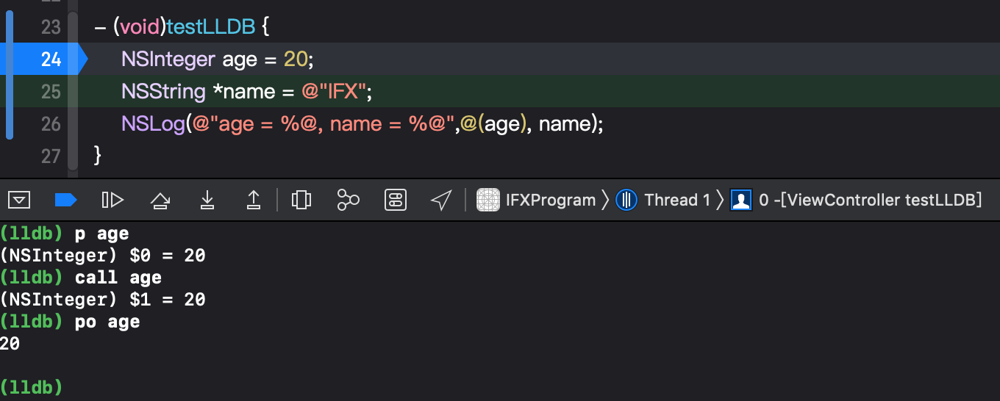
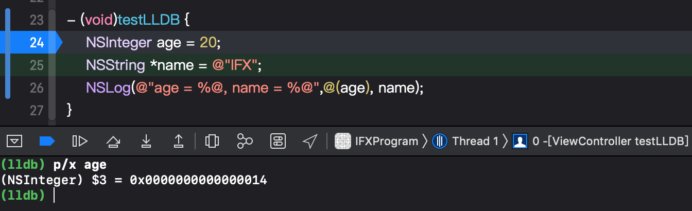
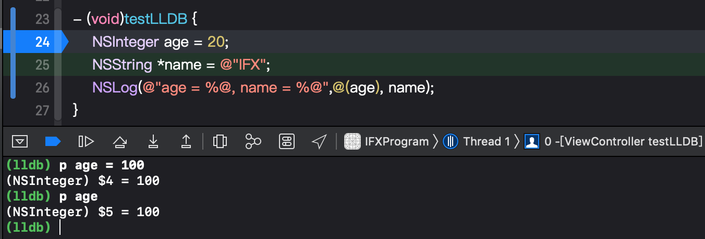
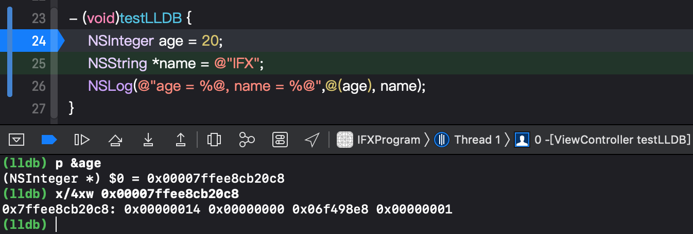
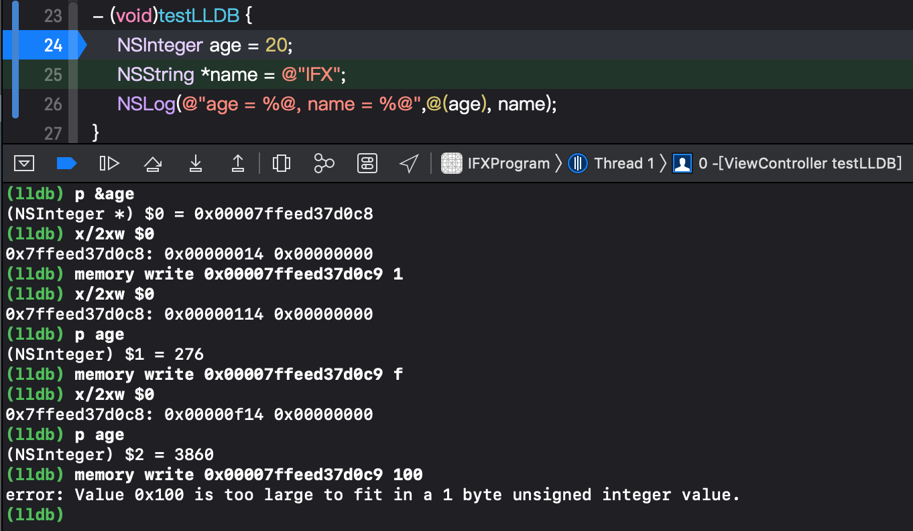
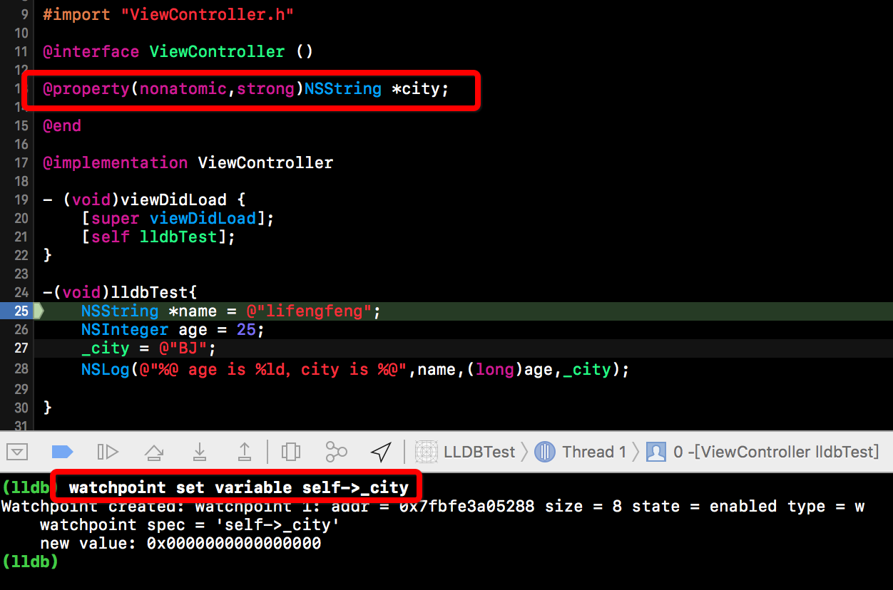
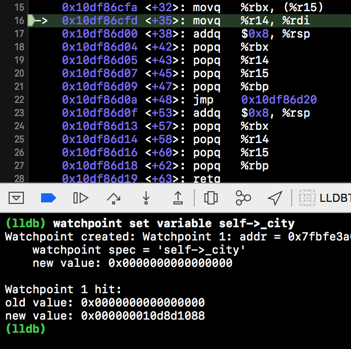
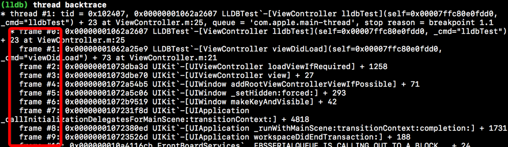
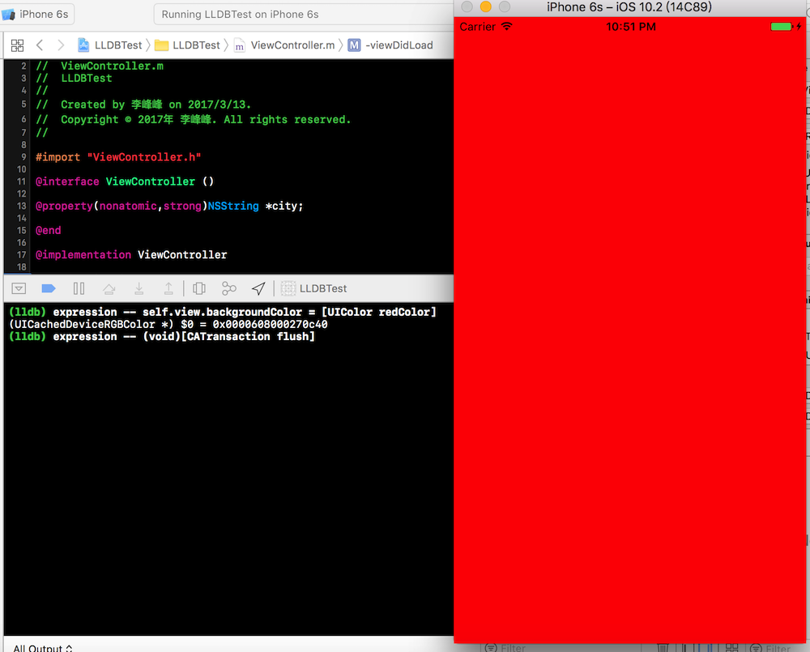

# LLDB

## 1. 概述
LLDB全称 [ Low Level Debugger ], 默认内置于Xcode中的动态调试工具。标准的 LLDB 提供了一组广泛的命令，旨在与熟悉的 GDB 命令兼容。 除了使用标准配置外，还可以很容易地自定义 LLDB 以满足实际需要。

## 2. 命令

LLBD 语法结构：

```
<command> [<subcommand> [<subcommand>...]] <action> [-options [option-value]] [argument [argument...]]

<command>(命令)和<subcommand>(子命令)：LLDB调试命令的名称。命令和子命令按层级结构来排列：一个命令对象为跟随其的子命令对象创建一个上下文，子命令又为其子命令创建一个上下文，依此类推。
<action>：执行命令的操作
<options>：命令选项
<arguement>：命令的参数
[]：表示命令是可选的，可以有也可以没有
```

例如：

```
breakpoint set -f main.m -l 16
```

与上面语法结构对应的是：

```
command: breakpoint 添加断点命令
action: set 表示设置断点
option: -f 表示在某文件添加断点
arguement: mian.m 表示要添加断点的文件名为mian.m
option: -l 表示某一行
arguement: 16 表示第16行
```

Commands，subcommands，options，option values和arguments都是以空格分隔的，双引号用于保护选项值和参数中的空格。 如果需要将反斜杠或双引号字符放入参数中，则在该参数前面加上反斜杠。 LLDB使用单引号和双引号是等价的。例如：

```
(lldb) command [subcommand] -option "some \"quoted\" string"
```

也可以这样写：

```
(lldb) command [subcommand] -option 'some "quoted" string'
```

常用命令

```
apropos           -- 列出与单词或主题相关的调试器命令
breakpoint        -- 在断点上操作的命令 (详情使用'help b'查看)
bugreport         -- 用于创建指定域的错误报告
command           -- 用于管理自定义LLDB命令的命令
disassemble       -- 拆分当前目标中的特定说明。 默认为当前线程和堆栈帧的当前函数
expression        -- 求当前线程上的表达式的值。 以LLDB默认格式显示返回的值
frame             -- 用于选择和检查当前线程的堆栈帧的命令
gdb-remote        -- 通过远程GDB服务器连接到进程。 如果未指定主机，则假定为localhost
gui               -- 切换到基于curses的GUI模式
help              -- 显示所有调试器命令的列表，或提供指定命令的详细信息
kdp-remote        -- 通过远程KDP服务器连接到进程。 如果没有指定UDP端口，则假定端口41139
language          -- 指定源语言
log               -- 控制LLDB内部日志记录的命令
memory            -- 用于在当前目标进程的内存上操作的命令
platform          -- 用于管理和创建平台的命令
plugin            -- 用于管理LLDB插件的命令
process           -- 用于与当前平台上的进程交互的命令
quit              -- 退出LLDB调试器
register          -- 命令访问当前线程和堆栈帧的寄存器
script            -- 使用提供的代码调用脚本解释器并显示任何结果。 如果没有提供代码，启动交互式解释器。
settings          -- 用于管理LLDB设置的命令
source            -- 检查当前目标进程的调试信息所描述的源代码的命令
target            -- 用于在调试器目标上操作的命令
thread            -- 用于在当前进程中的一个或多个线程上操作的命令
type              -- 在类型系统上操作的命令
version           -- 显示LLDB调试器版本
watchpoint        -- 在观察点上操作的命令
```

缩写命令 (使用 'help command alias'查看更多信息):

```
add-dsym  -- ('target symbols add')  通过指定调试符号文件的路径，或使用选项指定下载符号的模块，将调试符号文件添加到目标的当前模块中的一个
attach    -- ('_regexp-attach')  通过ID或名称附加到进程
b         -- ('_regexp-break')  使用几种简写格式之一设置断点
bt        -- ('_regexp-bt')  显示当前线程的调用堆栈。通过数字参数设置最多显示帧数。参数“all”显示所有线程
c         -- ('process continue')  继续执行当前进程中的所有线程
call      -- ('expression --')  计算当前线程上的表达式,使用LLDB的默认格式显示返回的值
continue  -- ('process continue')  继续执行当前进程中的所有线程
detach    -- ('process detach')  脱离当前目标进程
di        -- ('disassemble')  拆分当前目标中的特定说明。 默认为当前线程和堆栈帧的当前函数
dis       -- ('disassemble')  同上
display   -- ('_regexp-display')  在每次停止时计算表达式（请参阅'help target stop-hook'）
down      -- ('_regexp-down')  选择一个新的堆栈帧。默认为移动一个帧，数字参数可以指定值
env       -- ('_regexp-env')  查看和设置环境变量的简写
exit      -- ('quit')  退出LLDB调试器
f         -- ('frame select')  从当前线程中通过索引选择当前堆栈帧（参见'thread backtrace'）
file      -- ('target create')  使用参数作为主要可执行文件创建目标
finish    -- ('thread step-out')  完成当前堆栈帧的执行并返回后停止。 默认为当前线程
image     -- ('target modules')  用于访问一个或多个目标模块的信息的命令
j         -- ('_regexp-jump')  将程序计数器设置为新地址
jump      -- ('_regexp-jump')  同上
kill      -- ('process kill')  终止当前目标进程
l         -- ('_regexp-list')  使用几种简写格式之一列出相关的源代码
list      -- ('_regexp-list')  同上
n         -- ('thread step-over')  源级单步执行、步进调用，默认当前线程
next      -- ('thread step-over')  同上
nexti     -- ('thread step-inst-over')  指令级单步执行、步进调用，默认当前线程
ni        -- ('thread step-inst-over')  同上
p         -- ('expression --')  计算当前线程上表达式的值，以LLDB默认格式显示返回值
parray    -- ('expression -Z %1   --')  同上
po        -- 计算当前线程上的表达式。显示由类型作者控制的格式的返回值。
poarray   -- ('expression -O -Z %1    --')  计算当前线程上表达式的值，以LLDB默认格式显示返回值
print     -- ('expression --')  同上
q         -- ('quit')  退出LLDB调试器
r         -- ('process launch -X true --')  在调试器中启动可执行文件
rbreak    -- ('breakpoint set -r %1')  在可执行文件中设置断点或断点集
repl      -- ('expression -r  -- ')  E计算当前线程上表达式的值，以LLDB默认格式显示返回值
run       -- ('process launch -X true --')  在调试器中启动可执行文件
s         -- ('thread step-in')  源级单步执行、步进调用，默认当前线程
si        -- ('thread step-inst')  指令级单步执行、步进调用，默认当前线程
sif       -- 遍历当前块，如果直接步入名称与TargetFunctionName匹配的函数，则停止
step      -- ('thread step-in')  源级单步执行、步进调用，默认当前线程
stepi     -- ('thread step-inst')  指令级单步执行、步进调用，默认当前线程
t         -- ('thread select')  更改当前选择的线程
tbreak    -- ('_regexp-tbreak')  使用几种简写格式之一设置单次断点
undisplay -- ('_regexp-undisplay')  每次停止时停止显示表达式（由stop-hook索引指定）
up        -- ('_regexp-up')  选择较早的堆栈帧。 默认为移动一个帧，数值参数可以指定任意数字
x         -- ('memory read')  从当前目标进程的内存中读取
```

当然，上面大部分命令是不经常使用的，不用全部记住，需要查找想要的命令时可以直接使用”help”命令显示所有调试器命令的列表，或查询指定命令的详细信息。

```
//查看全部命令
(lldb)help
//查看某一命令使用
(lldb)help memory write
```

## 3. 示例

### 3.1 打印命令

打印命令是在实际开发中是经常使用的，在前面的例子中就测试了使用print命令去打印 age 的值，除了 print 命令外，还有多种打印命令： p、po、call。我们可以通过实际测试看下他们的区别：



可以看到 po 命令只是打印数值，而 print、p、call 命令还打印了变量的类型。所以，在实际开发中根据需要选择合适的打印命令。

在打印变量的值的时候，我们还可以使用 `print/<fmt>` 或者简化的 `p/<fmt>` 指定打印格式，例如打印十六进制:



从前面的命令列表可以看到 print、p、po、call 都是 expression 命令的简写，而 expression 的作用是“求当前线程上的表达式的值”，也就是说我们可以利用它们更改变量的值，例如我们将 age 的值修改为100：



### 3.2 内存读写

memory read（简写为x）/memory write分别进行内存读写操作，格式如下：

```
读取内存 memory read/数量格式字节数 内存地址 x/数量格式字节数 内存地址（eg: x/3xw 0x10010）

格式：x是16进制 f是浮点 d是10进制

字节大小： b：byte 1字节 h：half word 2字节 w：word 4字节 g：giant word 8字节

修改内存中的值 memory write 内存地址 数值（eg: memory write 0x0000010 10）
```



**注：** 内存地址可以直接用\$0表示，即：x/4wd \$0



**注：** 默认是修改某个地址的16进制值（上例修改的地址为age地址+1）只能修改一个字节（16进制两位），超过两位（比如上例中的100）报错 通过help memory write 查看更多使用方式。

### 3.3 断点操作

要在调试器中创建断点，可以使用 breakpoint set 命令:

```
breakpoint set
-M <method> ( --method <method> )
-S <selector> ( --selector <selector> )
-b <function-name> ( --basename <function-name> )
-f <filename> ( --file <filename> )
-l <linenum> ( --line <linenum> )
-n <function-name> ( --name <function-name> )
…
```

例如：

```
(lldb) breakpoint set -f ViewController.m -l 25
Breakpoint 2: where = LLDBTest`-[ViewController lldbTest] + 50 at ViewController.m:25, address = 0x0000000102c90752
```

上面含义为在 ViewController.m 文件的第25行添加断点。

也可以使用缩写形式  br。虽然 b 是一个完全不同的命令 ( _regexp-break 的缩写)，但恰好也可以实现和上面同样的效果。

如果给当前的文件设置断点可以用下面的命令：

```
(lldb) b 25
Breakpoint 3: where = LLDBTest`-[ViewController lldbTest] + 50 at ViewController.m:25, address = 0x0000000102c90752
```

也可以通过方法名设置断点：

```
(lldb) breakpoint set -n lldbTest
Breakpoint 5: where = LLDBTest`-[ViewController lldbTest] + 23 at ViewController.m:23, address = 0x0000000102c90737
```

上面 -n 表示根据方法名设置断点。

查看所有断点：`breakpoint list` (或者 `br li`)

开启和关闭断点：`breakpoint enable <breakpointID>` 和 `breakpoint disable <breakpointID>`；

删除断点：`breakpoint delete <breakpointID>`

单步进入：`thread step-in`（或 step 或 s ）

单步跳过：`thread step-over`（或 next 或 n）

继续运行：`thread continue`（或 continue 或 c）

### 3.4 设置观察点

通过上面的命令列表可以知道设置观察点使用 watchpoint 命令，如果说 breakpoint 是对方法生效的断点，watchpoint就是对地址生效的断点，可以用他观察这个属性的地址。如果地址里面的东西改变了，就让程序中断。设置观察点可以用来观察变量或者属性值的变化。

```
watchpoint set variable
```

例如，我们要观察一个名为city的属性值：

```
watchpoint set variable self->_city
```

**要特别注意**，上面的”self->_city”不可以改为”self.city”，因为”self.city”是调用city的getter方法！

如下，我们新增一个city属性并设置观察点：



由于在第27行我们修改（设置）了 city 的值，所以继续运行程序会中断并且打印提示：



我们也可以使用下面命令直接观察某个地址的变化：

```
watchpoint set expression
```

比如我们要观察上面 city 属性的地址变化，应该怎么获取 city 的地址呢？可以使用上面的打印命令，通过打印命令获取到地址之后就可以观察地址的变化了：

```
(lldb) p & _city
(NSString **) $0 = 0x00007ffc80e100c8
(lldb) watchpoint set expression 0x00007ffc80e100c8
Watchpoint created: Watchpoint 1: addr = 0x7ffc80e100c8 size = 8 state = enabled type = w
    new value: 0
```

watchpoint 的查询、删除等命令与 breakpoint 的命令使用一样，就不再一一列举用法了：

```
watchpoint delete 
watchpoint list
watchpoint disable
watchpoint enable
```

### 3.5 打印线程堆栈信息

可以使用 thread backtrace（或 bt ）命令打印线程堆栈信息：



thread backtrace 后面可以添加命令选项：

```
-c：设置打印堆栈的帧数(frame) 
-s：设置从哪个帧(frame)开始打印 
-e：是否显示额外的回溯
```

Debug 的时候，也许会因为各种原因，我们不想让代码执行某个方法，或者要直接返回一个想要的值。可以使用 thread return 命令：

```
thread return '要返回的值'
```

thread return 不让代码执行某个方法，可以在某个方法的开始位置设置一个断点，当程序运行到断点的位置时直接返回我们设置的返回值。

thread其他命令：

```
thread list //打印所有线程

thread select //跳到某一个线程

thread info //输出当前线程的信息
```

### 3.6 查看帧栈

打印当前帧栈所有变量：

```
frame variable
```

例如：

```
(lldb) frame variable
(ViewController *) self = 0x00007fc0684085f0
(SEL) _cmd = "lldbTest"
(__NSCFConstantString *) name = 0x0000000102a2f068 @"lifengfeng"
(NSInteger) age = 25
```

打印某个变量：

```
frame variable '变量名'
```

例如：

```
(lldb) frame variable name
(__NSCFConstantString *) name = 0x0000000102a2f068 @"lifengfeng"
```

查看当前帧栈的信息：

```
frame info
```

例如：

```
(lldb) frame info
frame #0: 0x0000000102a2d63f LLDBTest`-[ViewController lldbTest](self=0x00007fc0684085f0, _cmd="lldbTest") + 79 at ViewController.m:28
```

跳转到指定帧栈：

```
frame select
```

例如：

```
(lldb) frame select 0
frame #0: 0x0000000102a2d63f LLDBTest`-[ViewController lldbTest](self=0x00007fc0684085f0, _cmd="lldbTest") + 79 at ViewController.m:28
   25       NSString *name = @"lifengfeng";
   26       NSInteger age = 25;
   27       _city = @"BJ";
-> 28        NSLog(@"%@ age is %ld，city is %@",name,(long)age,_city);
   29       
   30   }
   31
```

### 3.7 动态改变程序的运行轨迹

expression命令用来执行一个命令，并将表达式的结果输出。除此之外，expression还可以动态改变程序的运行轨迹。例如，我们上面例子中就是一个空白的ViewController，我们可以利用expression命令来改变UI的显示，如self.view的颜色等。

expression的完整语法如下：

```
expression --
```

上面的”–“是命令选项结束符，表示所有的命令选项已经设置完毕，如果没有命令选项，–可以省略。

例如，我们改变self.view的颜色：



其中，下面的命令用于刷新UI。

```
expression -- (void)[CATransaction flush]
```

## 参考

* [使用 LLDB 调试 APP](https://juejin.im/entry/58c75b258ac24707201369c4)
* [LLDB常用命令](https://www.dllhook.com/post/51.html)
* [LLDB官网](https://lldb.llvm.org)
* [LLDB Quick Start Guide](https://developer.apple.com/library/archive/documentation/IDEs/Conceptual/gdb_to_lldb_transition_guide/document/lldb-basics.html)