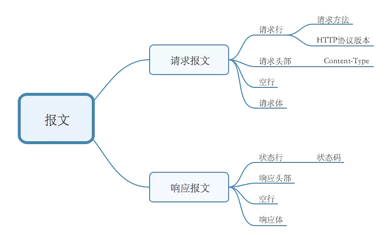
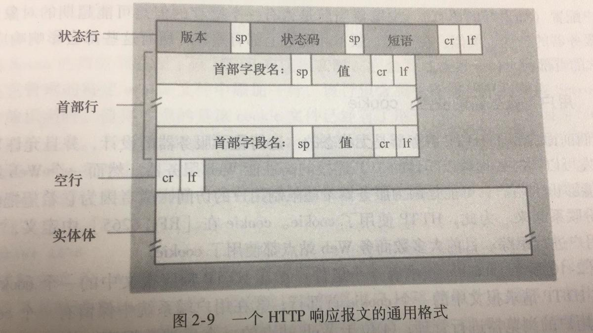
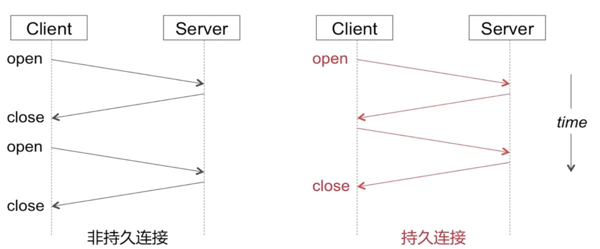

# 网络相关之HTTP协议

是一种详细规定了浏览器和万维网(WWW = World Wide Web)服务器之间互相通信的规则，通过因特网传送万维网文档的数据传送协议。
HTTP是基于TCP的应用`层协议`

>(OSI网络七层协议从上到下分别是 `应用层`、`表示层`、`会话层` 、`传输层`、`网络层` 、`数据链路层`、`物理层`）

- 请求/响应报文
- 连接建立流程
- HTTP的特点



## 一、请求报文和响应报文

### 1、请求报文


如下：

```http
POST /somedir/page.html HTTP/1.1    
//以上是请求行:方法字段、URL字段和HTTP版本字段
Host: www.user.com
Content-Type: application/x-www-form-urlencoded
Connection: Keep-Alive
User-agent: Mozilla/5.0.    
Accept-lauguage: fr  
//以上是首部行
（此处必须有一空行）  //空行分割header和请求内容 
name=world   请求体
```

**Host**：指明了该对象所在的主机
**Connection**：`Keep-Alive`首部行用来表明该浏览器告诉服务器使用持续连接
**Content-Type**: `x-www-form-urlencoded`首部行用来表明 HTTP会将请求参数用key1=val1&key2=val2的方式进行组织，并放到请求实体里面
**User-agent**：首部行用来指明用户代理，即向服务器发送请求的浏览器类型
**Accept-lauguage**：首部行表示用户想得到该对象的法语版本（如果服务器中有这样的对象的话），否则，服务器应发送它的默认版本

### 2、响应报文



如下：

```http
HTTP/1.1 200 OK    
//以上是状态行：协议版本字段、状态码、相应状态信息
Connection：close
Server:Apache/2.2.3(CentOS)
Date: Sat, 31 Dec 2005 23:59:59 GMT
Content-Type: text/html
Content-Length: 122
//以上是首部行
（此处必须有一空行）  //空行分割header和实体主体
(data data data data)//响应实体主体
```

状态码及其相应的短语指示了请求的结果。

一些常见的状态码和对应的短语：

- **200 OK**：请求成功，信息在返回的响应报文中
- **301 Moved Permanently**：请求的对象已经被永久转移了，新的URL定义在响应报文中的Location：首部行中。客户软件将自动获取新的URL
- **400 Bad Request**：一个通用差错代码，指示该请求不能被服务器理解
- **404 Not Found**：被请求的文件不在服务器上
- **505 HTTP Version Not Supported**：服务器不支持请求报文使用的HTTP协议版本

>4开头的状态码通常是客户端的问题，5开头的则通常是服务端的问题

**Connection**：close首部行告诉客户，发送完报文后将关闭TCP连接。
**Date**:指的不是对象创建或最后修改的时间，而是服务器从文件系统中检索到该对象，插入到响应报文，并发送该响应报文的时间。
**Server**: 首部行指示该报文是由一台Apache Web服务器产生的，类似于HTTP请求报文里的User-agent
**Content-Length**：首部行指示了被发送对象中的字节数
**Content-Type**：首部行指示了实体体中的对象是HTML文本

## 二、HTTP的请求方式

GET、POST、PUT、DELETE、HEAD、OPTIONS

### 1、GET和POST方式的区别

**从语法角度来看，最直观的区别就是:**

- GET的请求参数一般以?分割拼接到URL后面，POST请求参数在Body里面
- GET参数长度限制为2048个字符，POST一般是没限制的
GET请求由于参数裸露在URL中， 是不安全的，POST请求则是相对安全
- 之所以说是相对安全，是因为，虽然POST参数非明文，但如果被抓包，GET和POST一样都是不安全的。(使用HTTPS保证安全)

**而从语义的角度来看：**

GET：获取资源是 `安全的`，`幂等的`(只读的，纯粹的)， `可缓存的`
POST：获取资源是 `非安全的`，`非幂等的`，`不可缓存的`

- 这里的**安全**是指不应引起Server端的任何状态变化。

GET的语义就是获取数据，是不会引起服务器的状态变化的，即是安全的。（HEAD，OPTIONS也是安全的）
而POST语义则是提交数据，是可能会引起服务器状态变化的，即是不安全的

- **幂等**:同一个请求方法执行多次和执行一次的效果完全相同

显然GET请求是幂等而POST请求是非幂等的。
这里用幂等形容GET还不够，因为GET不止是执行多次和执行一次的效果完全相同，而且是执行一次和执行零次的效果也是完全相同的。

- **可缓存的**
请求是否可以被缓存。
GET请求会主动进行Cache

以上特性，并非并列，正是因为GET是幂等的只读的，即GET请求除了返回数据不会有其他副作用，所以GET才是安全的，从而可以直接由CDN缓存，大大减轻服务器的负担，也就是可缓存的。
而POST是非幂等的，即除了返回数据还会有其他副作用，所以POST是不安全的，必须交由web服务器处理，即是 不可缓存的

**GET和POST本质上就是TCP链接，并无差别。但是由于HTTP的规定和浏览器/服务器的限制，导致他们在应用过程中体现出一些不同。**

在响应时，GET产生一个TCP数据包；POST产生两个TCP数据包:
对于GET方式的请求，浏览器会把Header和实体主体一并发送出去，服务器响应200（返回数据）；
而对于POST，浏览器先发送Header，服务器响应100 Continue，浏览器再发送实体主体，服务器响应200 OK（返回数据）。

### 2、GET 相对 POST 的优势是什么？

- 1、最大的优势就是方便。GET 的URL可以直接手输，从而GET请求中的URL可以被存在书签里，或者历史记录里
- 2、可以被缓存，大大减轻服务器的负担

所以大多数情况下，还是用GET比较好。

## 三、HTTP的特点

- 无连接、 无状态
- HTTP的持久连接、Cookie/Session

### 1、HTTP的无状态

即协议对于事务处理没有记忆能力。
每次的请求都是独立的，它的执行情况和结果与前面的请求和之后的请求时无直接关系的，它不会受前面的请求应答情况直接影响，也不会直接影响后面的请求应答情况
也就是说**服务器中没有保存客户端的状态，客户端必须每次带上自己的状态去请求服务器**
标准的HTTP协议指的是不包括cookies，session，application的HTTP协议

### 2、HTTP的持久连接



- 非持久连接：每个连接处理一个请求-响应事务。

- 持久连接：每个连接可以处理多个请求-响应事务。

持久连接情况下，服务器发出响应后让TCP连接继续打开着。同一对客户/服务器之间的后续请求和响应可以通过这个连接发送。

`HTTP/1.0` 使用非持久连接。  `HTTP/1.1` 默认使用持久连接  `<keep-alive>`。

非持久连接的每个连接，TCP得在客户端和服务端分配TCP缓冲区，并维持TCP变量，会严重增加服务器负担。而且每个对象都有2个RTT(Round Trip Time，也就是一个数据包从发出去到回来的时间)的延迟，由于TCP的拥塞控制方案,每个对象都遭受TCP缓启动，因为每个TCP连接都起始于缓启动阶段

### 3、HTTP持久连接怎么判断一个请求是否结束的？

- Content-length：根据所接收字节数是否达到Content-length值
- chunked(分块传输):Transfer-Encoding。当选择分块传输时，响应头中可以不包含Content-Length，服务器会先回复一个不带数据的报文（只有响应行和响应头和\r\n），然后开始传输若干个数据块。当传输完若干个数据块后，需要再传输一个空的数据块，当客户端收到空的数据块时，则客户端知道数据接收完毕。


