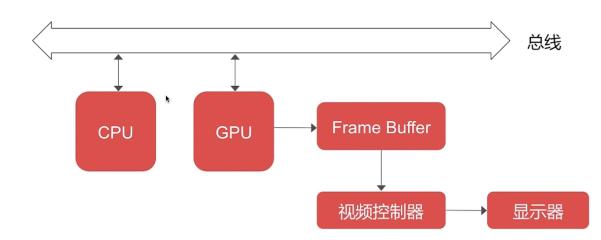

<!--  -->

<!-- 

 参考 

 -->

1. [UIView 和 CALayer 之间的关系？](#1)
2. [事件传递与视图响应链](#2)
3. [图像显示原理](#3)

---
UIView 和 CALayer 之间的关系？

 参考 

- UIView负责视图的布局和管理，事件处理。
- CALayer负责视图的绘制和动画。
- 这样设计符合单一职责原则，方便复用。

2. 事件传递与视图响应链

 参考 

- [响应者链](https://github.com/luckyvondoit/iOS/blob/master/UIKit/ResponderChain/ResponderChain.md)

3. 图像显示原理

 参考 

1. CPU:输出位图
2. GPU :图层渲染，纹理合成
3. 把结果放到帧缓冲区(frame buffer)中
4. 再由视频控制器根据vsync信号在指定时间之前去提取帧缓冲区的屏幕显示内容
5. 显示到屏幕上

