## iOS 瘦包常见方式梳理
微信号 zsxjtip

> 做个广告：本文是作者发布在小专栏上的付费文章，征得作者同意后发布在小集公众号，专栏地址是  `https://xiaozhuanlan.com/colin` 。作者关于  `iOS图像处理`  的系列文章很不错，如果对这方面有研究，不妨订阅一下。  

关于瘦包这个话题，之前大家讨论的已经够多了。

之所以再写这篇文章，主要是对前段时间工作的一个总结、梳理。同时也补全优化这个系列。

> PS：  
> 本文主要是思路、常见方式的梳理，工具的介绍。  
> 具体的优化数据、内容，就不对外说明了。  

那么，开始吧～

## 1. 预备知识

### 1.1 App Thinning

什么是 App Thinning？当然是减小包体积了，这也要说明吗？

当然不是.. 这里的 App Thinning 是指，iOS 9 之后引入的一项优化。官方描述如下：

> The App Store and operating system optimize the installation of iOS, tvOS, and watchOS apps by tailoring app delivery to the capabilities of the user’s particular device, with minimal footprint. This optimization, called app thinning, lets you create apps that use the most device features, occupy minimum disk space, and accommodate future updates that can be applied by Apple. Faster downloads and more space for other apps and content provides a better user experience.  

即，Apple 会尽可能的，自动降低分发到具体用户时，所需要下载的 App 大小。这其中又包括三项主要的功能： `Slicing`、`Bitcode`、`On-Demand Resources` 。

#### 1.1.1 Slicing

当向 App Store Connect 上传  `.ipa`  后，App Store Connect 构建过程中，会自动分割该 App，创建特定的变体（variant）以适配不同设备。然后用户从 App Store 中下载到的安装包，即这个特定的变体。这一过程，就是 Slicing。

> Slicing 是创建、分发不同变体以适应不同目标设备的过程。  

而变体之间的差异，又具体体现在架构和资源上。换句话说，App Slicing 仅向设备传送与之相关的资源（取决于屏幕分辨率，架构等等）

其中，2x 和 3x 的细分，要求图片放在  **Asset Catalog**  中管理。Bundle 内的则还是会同时包含。

下图中，右侧的则是各个不同的 variant。

#### 1.1.2 Bitcode

> Bitcode is an intermediate representation of a compiled program. Apps you upload to iTunes Connect that contain bitcode will be compiled and linked on the App Store. Including bitcode will allow Apple to re-optimize your app binary in the future without the need to submit a new version of your app to the App Store.  

Bitcode 是一种 **程序中间码** 。包含 Bitcode 配置的程序将会在 App Store Connect 上被重新编译和链接，进而对可执行文件做优化。 **这部分都是在服务端自动完成的，所以假如以后 Apple 推出了新的 CPU 架构或者以后 LLVM 推出了一系列优化，我们也不再需要为其发布新的安装包了，Apple Store 会为我们自动完成这步，然后提供对应的 variant 给具体设备。**

对于 iOS 而言，Bitcode 是可选的（Xcode7 后新项目，默认开启），对于 watchOS 和 tvOS，Bitcode 则是必须的。开启方式如下：

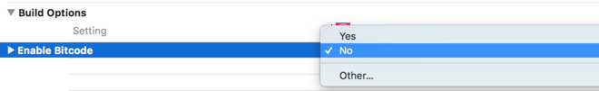
开启 Bitcode，有这么两点需要特别注意：

* 全部都要支持

* 崩溃定位

所谓全部，就是指我们依赖的静态库、动态库，都必须包含 Bitcode。另外用 Cocoapods 管理的第三方库，都需要开启 Pods 工程中的 BitCode。否则，会编译失败。

另外，开启 Bitcode 后，最终的可执行文件是 Apple 自动生成的，同时会产生新的符号表文件，所以我们无法使用自己包生成的 dSYM 符号化文件来进行符号化。

> For Bitcode enabled builds that have been released to the iTunes store or submitted to TestFlight, Apple generates new dSYMs. You’ll need to download the regenerated dSYMs from Xcode and then upload them to Crashlytics so that we can symbolicate crashes.  
> For Bitcode enabled apps, ensure that you have checked “Include app symbols for your application…” so that we can provide the most accurate crash reports.  

上面是 fabric 中关于 Downloading Bitcode dSYMs 的描述。

在上传到 App Store 时需要勾选 “Include app symbols for your application…” 。勾选之后 Apple 会自动生成对应的 dSYM，然后可以在 Xcode —> Window —> Organizer 中， 或者 Apple Store Connect 中下载对应的 dSYM 来进行符号化：

那么你可能疑惑，Bitcode 对 App Thining 有什么作用？

在 New Features in Xcode 7 中，有这么一段描述：

> Bitcode. When you archive for submission to the App Store, Xcode will compile your app into an intermediate representation. The App Store will then compile the bitcode down into the 64 or 32 bit executables as necessary.  

即，App Store 会再按需将这个 bitcode 编译进 32 / 64 位的可执行文件。

所以，网上铺天盖地的，都是说 Bitcode 完成了具体架构的拆分，从而实现瘦包。

但我对这个观点持怀疑态度，我认为架构的拆分是由 Slicing 完成的，Bitcode 的优势，更多体现在性能、以及后续的维护上。

> PS：  
> 因为在写这篇文章的时候，美图秀秀已经放弃了 32位 以及 iOS 8，另外，其他依赖有的没开启 Bitcode，推动代价较大，故对这个结论，暂时没有验证。  

#### 1.1.3 On-Demand Resources

On-Demand Resource，即一部分图片可以被放置在苹果的服务器上，不随着 App 的下载而下载，直到用户真正进入到某个页面时才下载这些资源文件。

关于这点，目前未有这方面的打算，故不继续深入研究。

注意：如果还需要支持 iOS 9 以下系统，那么无法使用这个功能，否则上传的时候会失败。

### 1.2 包体积

首先理清两个概念：

* **.ipa（iOS App Store Package）** ：iOS 应用程序归档文件，即提交到 App Store Connect 的文件。

* **.app（Application）**  ：是应用的具体描述，即安装到 iOS 设备上的文件。

当我们拿到 Archive 后的 .ipa，使用 “归档实用工具” 打开后，Payload 目录下放的就是 .app 文件， 二者大小相当。

至于包体积，我们评判的标准，当然是以 App Store 上看到的为准。但是上传到 App Store Connect 处理完后，会自动帮我们生成在具体设备上看到的大小，如下：

这其中，又可以分成这两类： **Universal**  和  **具体设备** 。

Universal 指通用设备，即未应用 App Slicing 优化，同时包含了所有架构、资源。所以把体积特别大。

同时，观察 .ipa 文件的大小，可以发现和 Universal 对应的安装大小相当，稍微小一点，因为 App Store 对 .ipa 又做了加密处理。

再额外补充一点，有时候下载 App 的时候，会提示：“此项目大于150MB，除非此项目支持增量下载，否则您必须连接至WiFi才能下载。”。 这里的 150M 限制，是针对 **下载大小** 。

* 下载大小：通过 Wi-Fi 下载的压缩 App 大小。

* 安装大小：此 App 将在用户设备上占用的磁盘空间大小。

所以，我们要瘦包的话，关键在与减小 .app 文件的大小。另外，.ipa 文件的大小，可以作为最终的评判标准，不需要严格的上传验证。

### 1.3 .app 组成

提到瘦包，我们肯定是要对这个包的具体组成，进行分析，然后才能有目的的进行优化。

.app 文件显示包内容后，会看到 一大堆杂乱的文件。按照个人习惯，整理归类后，如下：

按照 Size 排序，这样哪部分占用比较严重就一目了然了。

这里介绍一个工具  `Hazel` 。

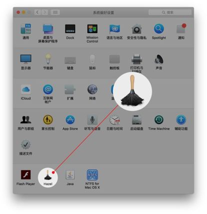
Hazel 是一款可以自动监控并整理文件夹的工具，其官网的介绍就是简单的一句话：Automated Organization for Your Mac。

它的使用有点类似于网络服务 IFTTT，你可以设定一个 if 条件，如果被监控的文件夹出现符合条件的项，那么对其执行 then 的操作（也可以通过邮箱的收件过滤规则来理解）。

即，我们可以自定义规则，来达到文件归类。

比如这里，为了对 .app 内的文件进行细分，针对文件的具体情况，我添加了“按类型”、“按模块” 两套规则，具体如下：

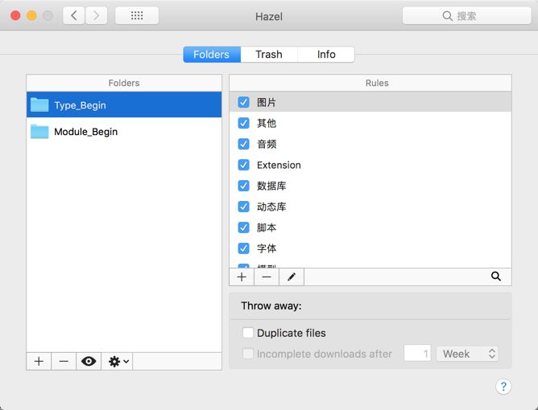
这样，每次有新的 .app，都可以对相关的文件进行自动划分，一劳永逸。强烈推荐～

回到我们的分析环节，按照优先级，以及具体的业务需求，接下去，我将会对 “可执行文件、资源、动态库、Extension” 这四部分进行详细优化、说明。

## 2. Architectures

因为美图秀秀已经放弃了 32位 以及 iOS 8，所以多架构本身的影响，就不去考虑了。

当然，去掉 armv7 后，可执行文件以及库的大小，必然会大大减小。即本地 .ipa 的大小也会大大减小。

但是需要注意，iOS 9 之后的设备，App Store 上显示的安装大小，不受影响。原因就是之前提到的 App Slicing。

这里不再细说，去不去 32位 支持，还是据项目实际情况看，没什么参考价值。

## 3. Resources

资源部分的优化，说白了就是对内的一次审查，规范化。

按照个人习惯，我会把资源进一步细分成如下：（同样，可以借助 Hazel 来完成）

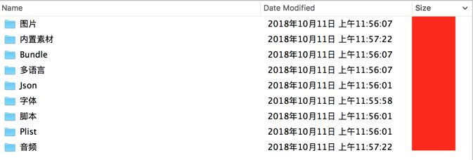
其中，图片 和 Bundle 这两个文件夹，都指代图片资源。

* 图片：Assets.car

* Bundle：非放在 Asset Catalog 中管理的图片资源。包括 Bundle，散落的 png/jpg 等。

其他几个，就很好理解了。比如字体，就是内置的  `.ttf / .otf`  等字体文件。

音频又包括  `.mp3 / .mp4 / .caf / .dat`  等音频文件。

在回到瘦包，针对资源部分，我这里按照这几种方式来进行：

* 无用文件删除

* 重复文件删除

* 大文件压缩

* 图片管理方式规范

* On-Demand Resource

其中，On-Demand Resource 上文已经提到，这里不再累述。游戏类的，有前置关卡依赖的，建议资源改用这种动态下载的方式。

### 3.1 无用文件删除

无用文件删除，主要包含图片和非图片部分。

非图片部分，资源较少，使用方式固定。比如音频，字体。这部分，需要靠人力去排查。

美图秀秀在这方面的优化空间有限，因为本身就没怎么依赖这些东西。

而无用图片，就比较多了。

主要使用一个开源的 Mac app，LSUnusedResources，来进行冗余图片的排查。

这个 App 的原理是，对某一文件目录下所有的源代码文件进行扫描，用正则表达式匹配出所有的@"xxx"字符串（会根据不同类型的源代码文件使用不同的匹配规则），形成“使用到的图片的集合”，然后扫描所有的图片文件名，查看哪些图片文件名不在“使用到的图片的集合”中，然后将这些图片文件呈现在结果中。

扫描速度快，扫描结果可以直接进行删除，导出等操作。

但是这工具，存在一点问题，会出现误报。主要还是因为项目中，使用到的图片方式不一。

比如， `icon_01_01.png、icon_1_1_highlighted.png`  这样的命名，都会被标记为无用。

查看源码，主要是因为模糊匹配这部分的源码，限定了至多一个下标索引的情况。

即，只会处理这类的：

* prefix + suffix + number

* prefix + number + suffix

* number + prefix + suffix

但显然，和项目现有的一些命名存在冲突。故，修改对应的正则，使之满足自己项目即可。

另外，喵神还提供了一个脚本 FengNiao，比较新，使用 Swift 开发的。FengNiao 的原理和 LSUnusedResources 差不多，都是先查找出项目中所有使用到的字符串和项目中所有的资源文件。然后二者进行匹配对比，计算差集就是未使用的资源。另外，FengNiao 是命令行工具，所以可以在 Xcode 中添加 Run Script，在每次构建的时候自动检测未使用的资源。

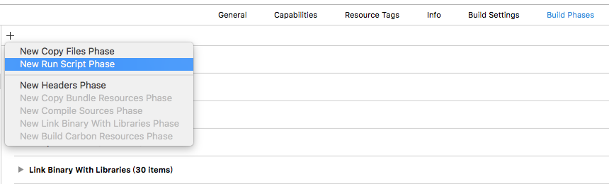

> PS：  
> 但是使用后发现，同样也会存在很多误报的情况。也需要改源码，才能适配现有的工程。故没有深入使用。  

当然，工具毕竟是工具，筛选出来的结果，还需要进行一轮人工校验，才能大胆的删除。

这部分的优化，视项目的具体情况而定。如果之前团队内部一直做的很规范，那这部分的优化空间也会比较小。

### 3.2 重复文件删除

重复文件，即两个内容完全一致的文件。这类文件的命名上，一般是不一样的。

这部分，主要是借助  `fdupes`  这个开源工具，它可以校验各资源的 MD5。

fdupes 是 Linux 下的一个工具，它由 Adrian Lopez 用 C 语言编写并基于 MIT 许可证发行，该应用程序可以在指定的目录及子目录中查找重复的文件。fdupes 通过对比文件的 MD5 签名，以及逐字节比较文件来识别重复内容，fdupes 有各种选项，可以实现对文件的列出、删除、替换为文件副本的硬链接等操作。

文件对比以下列顺序开始：

大小对比 > 部分 MD5 签名对比 > 完整 MD5 签名对比 > 逐字节对比

效率、准确率都极其高。强力推荐！

最终的检测结果，如下：

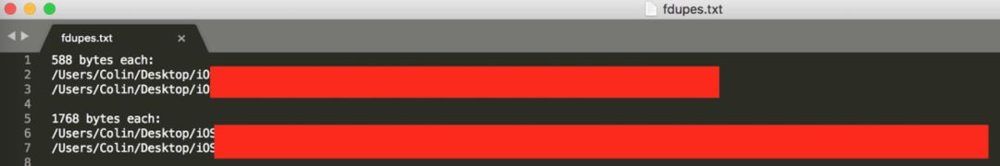
会细分出相同文件的大小，以及位置。

然后，就是具体的进行优化了。

### 3.3 大文件压缩

图片本身的压缩，建议使用  `ImageOptim` 。它直接整合了Win、Linux上诸多著名图片处理工具的特色功能，比如：PNGOUT，AdvPNG，Pngcrush，OptiPNG，JpegOptim，Gifsicle 等。

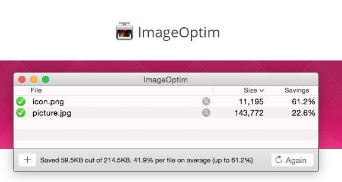
Xcode 提供的给我们两个编译选项来帮助压缩 PNG 图像：

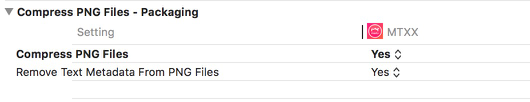
* **Compress PNG Files** ：打包的时候自动对图片进行无损压缩，使用的工具为 pngcrush，压缩比还是相当高的，比较流行的压缩软件 ImageOptim 也是使用 pngcrush 进行压缩 PNG 的。

* **Remove Text Medadata From PNG Files** ：移除 PNG 资源的文本字符，比如图像名称、作者、版权、创作时间、注释等信息。

在开启 Xcode 内置的 PNG 压缩后，使用 ImageOptim 对图片再手动进行一轮压缩，发现表现是正向的。

但之前今日头条有篇文章，里面提到一个观点：

> 在查阅了一些文档后，我们了解到，Xcode在构建的过程中，有一个步骤叫做compile asset catalog。在这个步骤中，Xcode会自行对png图片作压缩，并且会压缩成能够快速读取渲染的格式。如果我们对工程中的图片进行了ImageOptim的压缩，在compile asset catalog的过程中，Xcode会用自己的算法重新压缩，而这个”重新压缩“的过程，相当于将ImageOptim的压缩“回滚“了，很可能反而增大了图片。  

但在我验证过程中，未发现因为使用了 ImageOptim 压缩，而引起的增大现象。（会出现增大情况，但不是由于 ImageOptim，下午会提到。）

所以这里，我的建议是，保持 Xcode 提供的 Compress PNG Files 开启，再用 ImageOptim 对图片进行一轮压缩，尤其是 Bundle 内的，因为 Bundle 是直接拷贝进项目，并不会被 Xcode 进行压缩。还有 JPEG 格式的图像，也需要手动进行压缩。

### 3.4 图片管理方式规范

这部分，有一些常见的问题需要规避。

首先，我们要知道，工程中所有使用 Asset Catalog 管理的图片（在 .xcassets 文件夹下），最终输出的时候，都会被压缩到 Assets.car 内。

反之，不在 Assets.car 内的，我们将它统一归类为 Bundle 管理的。

Bundle 和 xcassets 的主要区别有：

* xcassets 里面的图片，只能通过 imageNamed 加载。Bundle 还可以通过 imageWithContentsOfFile 等方式。

* xcassets 里的 2x 和 3x，会根据具体设备分发，不会同时包含。而 Bundle 会都包含。（App Slicing）

* xcassets 内，可以对图片进行 Slicing，即裁剪和拉伸。Bundle 不支持。

* Bundle 内支持多语言，xcassets 不支持。

> 另外，使用 imageNamed 创建的 UIImage，会立即被加入到 NSCache 中（解码后的 Image Buffer），直到收到内存警告的时候，才会释放不在使用的 UIImage。  
> 而 imageWithContentsOfFile。它每次都会重新申请内存，相同图片不会缓存。  
> 所以，xcassets 内的图片，加载后会产生缓存。  

综上，我认为，常用的，较小的图，应该放在 xcassets 内管理。而大图应该放在 Bundle 内管理。

甚至大图，我们可以直接废弃掉 2x，全部使用 3x 大小的 jpg 图片。然后使用的时候，考虑使用 downsample 降低采样。

而 Assets.car，我们可以通过开源工具 Asset Catalog Tinkerer 来打开。

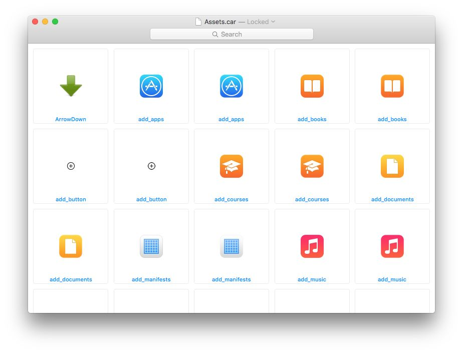
导出所有的图片，可以进行一次排序。理论上，这里的图片不允许大雨 100kb。如果有特别大的图片，则需要额外注意。

关于 xcassets，我们有这么几点需要注意：

* 图片的大小，一定要准确。不要出现图片太大的情况。

* 不要存放大图，大图会产生缓存。

* 不要存放 JPEG 格式图片，会导致图片变大。

关于 jpg 图，发现有这么一个现象：

.xcassets 内放的图片，是张 59 KB 的 JPEG 图像，打包后，从 Assets.car 中导出的，确实对应的 PNG 图像，同时，大小变成了 185 KB。而 185 KB，正是在 Mac 上，将一张 JPEG 转成 PNG，无额外处理的情况下，大小正好是 185 KB。

所以这里要注意，.xcassets 中要避免使用 JPEG 图像。

## 4. Executable file

可执行文件，即和项目同名的文件，一般是占用包体积最大的那个。

关于这部分的瘦身，这里会从以下两方面进行：

* 编译优化

* 文件优化

### 4.1 编译选项优化

#### 4.1.1 Generate Debug Symbols

> Enables or disables generation of debug symbols. When debug symbols are enabled, the level of detail can be controlled by the build ‘Level of Debug Symbols’ setting.  

调试符号是在编译时生成的。当 Generate Debug Symbol s选项设置为 YES时，每个源文件在编译成 .o 文件时，编译参数多了 -g 和 -gmodules 两项。打包会生成 symbols 文件。

设置为 NO 则 ipa 中不会生成 symbol 文件，可以减少 ipa 大小。但会影响到崩溃的定位。

保持默认的开启，不做修改。

#### 4.1.2 Asset Catalog Compiler

optimization 选项设置为 space 可以减少包大小

默认选项，不做修改。

#### 4.1.3 Dead Code Stripping

> For statically linked executables, dead-code stripping is the process of removing unreferenced code from the executable file. If the code is unreferenced, it must not be used and therefore is not needed in the executable file. Removing dead code reduces the size of your executable and can help reduce paging.  

删除静态链接的可执行文件中未引用的代码

Debug 设置为 NO， Release 设置为 YES 可减少可执行文件大小。

Xcode 默认会开启此选项，C/C++/Swift 等静态语言编译器会在 link 的时候移除未使用的代码，但是对于 Objective-C 等动态语言是无效的。因为 Objective-C 是建立在运行时上面的，底层暴露给编译器的都是 Runtime 源码编译结果，所有的部分应该都是会被判别为有效代码。

默认选项，不做修改。

#### 4.1.4 Apple Clang - Code Generation

Optimization Level 编译参数决定了程序在编译过程中的两个指标：编译速度和内存的占用，也决定了编译之后可执行结果的两个指标：速度和文件大小。

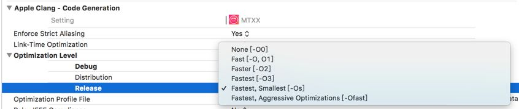
默认情况下，Debug 设定为 None[-O0] ，Release 设定为 Fastest,Smallest[-Os]。

6个级别对应的含义如下：

* **None[-O0]** 。 Debug 默认级别。不进行任何优化，直接将源代码编译到执行文件中，结果不进行任何重排，编译时比较长。主要用于调试程序，可以进行设置断点、改变变量 、计算表达式等调试工作。

* **Fast[-O,O1]** 。最常用的优化级别，不考虑速度和文件大小权衡问题。与-O0级别相比，它生成的文件更小，可执行的速度更快，编译时间更少。

* **Faster[-O2]** 。在-O1级别基础上再进行优化，增加指令调度的优化。与-O1级别相，它生成的文件大小没有变大，编译时间变长了，编译期间占用的内存更多了，但程序的运行速度有所提高。

* **Fastest[-O3]** 。在-O2和-O1级别上进行优化，该级别可能会提高程序的运行速度，但是也会增加文件的大小。

* **Fastest Smallest[-Os]** 。Release 默认级别。这种级别用于在有限的内存和磁盘空间下生成尽可能小的文件。由于使用了很好的缓存技术，它在某些情况下也会有很快的运行速度。

* **Fastest, Aggressive Optimization[-Ofast]** 。 它是一种更为激进的编译参数, 它以点浮点数的精度为代价。

默认选项，不做修改。

#### 4.1.5 Swift Compiler - Code Generation

Xcode 9.3 版本之后 Swift 编译器提供了新的 Optimization Level 选项来帮助减少 Swift 可执行文件的大小：

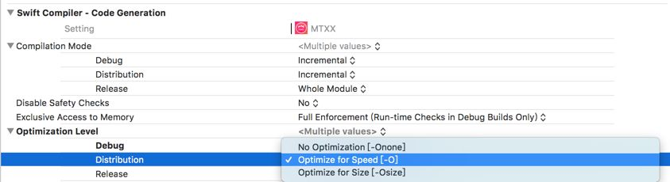
3个级别对应的含义如下：

* **No optimization[-Onone]** ：不进行优化，能保证较快的编译速度。

* **Optimize for Speed[-O]** ：编译器将会对代码的执行效率进行优化，一定程度上会增加包大小。

* **Optimize for Size[-Osize]** ：编译器会尽可能减少包的大小并且最小限度影响代码的执行效率。

> We have seen that using -Osize reduces code size from 5% to even 30% for some projects.  

> But what about performance? This completely depends on the project. For most applications the performance hit with -Osize will be negligible, i.e. below 5%. But for performance sensitive code -O might still be the better choice.  

官方提到，-Osize 根据项目不同，大致可以优化掉 5% - 30% 的代码空间占用。 相比 -0 来说，会损失大概 5% 的运行时性能。 如果你的项目对运行速度不是特别敏感，并且可以接受轻微的性能损失，那么 -Osize 是首选。

除了 -O 和 -Osize， 还有另外一个概念也值得说一下。 就是 Single File 和 Whole Module 。 在之前的 XCode 版本，这两个选项和 -O 是连在一起设置的，Xcode 9.3 中，将他们分离出来，可以独立设置：

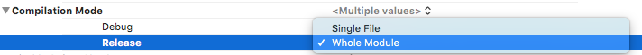
Single File 和 Whole Module 这两个模式分别对应编译器以什么方式处理优化操作。

* Single File：逐个文件进行优化，它的好处是对于增量编译的项目来说，它可以减少编译时间，对没有更改的源文件，不用每次都重新编译。并且可以充分利用多核 CPU，并行优化多个文件，提高编译速度。但它的缺点就是对于一些需要跨文件的优化操作，它没办法处理。如果某个文件被多次引用，那么对这些引用方文件进行优化的时候，会反复的重新处理这个被引用的文件，如果你项目中类似的交叉引用比较多，就会影响性能。

* Whole Module： 将项目所有的文件看做一个整体，不会产生 Single File 模式对同一个文件反复处理的问题，并且可以进行最大限度的优化，包括跨文件的优化操作。缺点是，不能充分利用多核处理器的性能，并且对于增量编译，每次也都需要重新编译整个项目。

如果没有特殊情况，使用默认的 Whole Module 优化即可。 它会牺牲部分编译性能，但的优化结果是最好的。

故，在 Relese 模式下 -Osize 和 Whole Module 同时开启效果会最好！

#### 4.1.6 Strip Symbol Information

1、Deployment Postprocessing
2、Strip Linked Product
3、Strip Debug Symbols During Copy
4、Symbols hidden by default

设置为 YES 可以去掉不必要的符号信息，可以减少可执行文件大小。但去除了符号信息之后我们就只能使用 dSYM 来进行符号化了，所以需要将 Debug Information Format 修改为 DWARF with dSYM file。

Symbols Hidden by Default 会把所有符号都定义成”private extern”，详细信息见官方文档。

故，Release 设置为 YES，Debug 设置为 NO。

#### 4.1.7 Exceptions

在 iOS微信安装包瘦身 一文中，有提到：

> 去掉异常支持，Enable C++ Exceptions和Enable Objective-C Exceptions设为NO，并且Other C Flags添加-fno-exceptions，可执行文件减少了27M，其中__gcc_except_tab段减少了17.3M，__text减少了9.7M，效果特别明显。可以对某些文件单独支持异常，编译选项加上-fexceptions即可。但有个问题，假如ABC三个文件，AC文件支持了异常，B不支持，如果C抛了异常，在模拟器下A还是能捕获异常不至于Crash，但真机下捕获不了（有知道原因可以在下面留言：）。去掉异常后，Appstore后续几个版本Crash率没有明显上升。  
> 个人认为关键路径支持异常处理就好，像启动时NSCoder读取setting配置文件得要支持捕获异常，等等  

看这个优化效果，感觉发现了新大陆。关闭后验证.. 毫无感知，基本没什么变化。

可能和项目中用到比较少有关系。故保持开启状态。

#### 4.1.8 Link-Time Optimization

Link-Time Optimization 是 LLVM 编译器的一个特性，用于在 link 中间代码时，对全局代码进行优化。这个优化是自动完成的，因此不需要修改现有的代码；这个优化也是高效的，因为可以在全局视角下优化代码。

苹果在 WWDC 2016 中，明确提出了这个优化的概念，What’s New in LLVM。并且说在苹果内部已经广泛地使用这个优化方法进行编译。

它的优化主要体现在如下几个方面：

1. **多余代码去除（Dead code elimination）** ：如果一段代码分布在多个文件中，但是从来没有被使用，普通的 -O3 优化方法不能发现跨中间代码文件的多余代码，因此是一个“局部优化”。但是Link-Time Optimization 技术可以在 link 时发现跨中间代码文件的多余代码。

2. **跨过程优化（Interprocedural analysis and optimization）** ：这是一个相对广泛的概念。举个例子来说，如果一个 if 方法的某个分支永不可能执行，那么在最后生成的二进制文件中就不应该有这个分支的代码。

3. **内联优化（Inlining optimization）** ：内联优化形象来说，就是在汇编中不使用 “call func_name” 语句，直接将外部方法内的语句“复制”到调用者的代码段内。这样做的好处是不用进行调用函数前的压栈、调用函数后的出栈操作，提高运行效率与栈空间利用率。

在新的版本中，苹果使用了新的优化方式 Incremental，大大减少了链接的时间。建议开启。

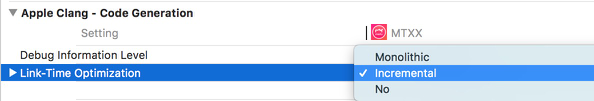
总结，开启这个优化后，一方面减少了汇编代码的体积，一方面提高了代码的运行效率。

### 4.2 文件优化

> PS：  
> 这部分，在尝试删除 100 多个无用类后，发现可执行文件仅 小了 100 多KB。故没有深入研究。这里简单介绍下一些方式，参考延伸阅读中部分内容。  

文件的优化，即通过删除无用类、无用方法、重复方法等，来达到可执行文件大小的减小。

> bang 有篇关于可执行文件组成的文章，建议看下，会对这方面有个清晰的认识。  

而如何筛选出符合条件的无用类、方法，则需要通过一些工具来完成。

因为这部分，我所做的尝试不多，简单的使用 fui 这个开源工具，找到无用的 import，然后人为审查删除。故不做太多的描述。网易有篇文章中，方法总结的很棒，这里引用下，感兴趣的可以从这里了解更多。

扫描无用代码的基本思路都是查找已经使用的方法/类和所有的类/方法，然后从所有的类/方法当中剔除已经使用的方法/类剩下的基本都是无用的类/方法，但是由于 Objective-C 是动态语言，可以使用字符串来调用类和方法，所以检查结果一般都不是特别准确，需要二次确认。目前市面上的扫描的思路大致可以分为 3 种：

* 基于 Clang 扫描

* 基于可执行文件扫描

* 基于源码扫描

#### 4.2.1 基于 clang 扫描

基本思路是基于 clang AST。追溯到函数的调用层级，记录所有定义的方法/类和所有调用的方法/类，再取差集。具体原理参考 如何使用 Clang Plugin 找到项目中的无用代码，目前只有思路没有现成的工具。

#### 4.2.2 基于可执行文件扫描

Mach-O 文件中的  `(__DATA,__objc_classlist)`  段表示所有定义的类， ( `__DATA.__objc_classrefs` ) 段表示所有引用的类(继承关系是在  `__DATA.__objc_superrefs`  中)；使用的方法和引用的方法也是类似原理。因此我们使用 otool 等命令逆向可执行文件中引用到的类/方法和所有定义的类/方法，然后计算差集。具体参考iOS微信安装包瘦身，目前只有思路没有现成的工具。

#### 4.2.3 基于源码扫描

一般都是对源码文件进行字符串匹配。例如将 A *a、[A xxx]、NSStringFromClass("A")、objc_getClass("A") 等归类为使用的类，@interface A : B 归类为定义的类，然后计算差集。

基于源码扫描 有个已经实现的工具 - fui，但是它的实现原理是查找所有 ＃import "A" 和所有的文件进行比对，所以结果相对于上面的思路来说可能更不准确。

#### 4.2.4 通过 AppCode 查找无用代码

AppCode  提供了 Inspect Code 来诊断代码，其中含有查找无用代码的功能。

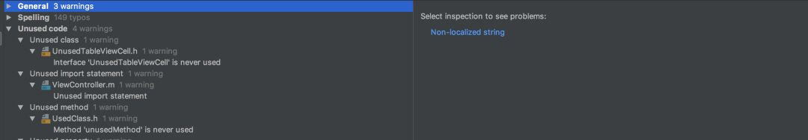
它可以帮助我们查找出 AppCode 中无用的类、无用的方法甚至是无用的 import ，但是无法扫描通过字符串拼接方式来创建的类和调用的方法，所以说还是上面所说的 基于源码扫描 更加准确和安全。

## 5. Frameworks

Framework 文件夹存放的是动态库。在 App 启动的时候才会被链接和加载。里面主要有两类库：

Swift 标准库和自己引入的其他依赖库。

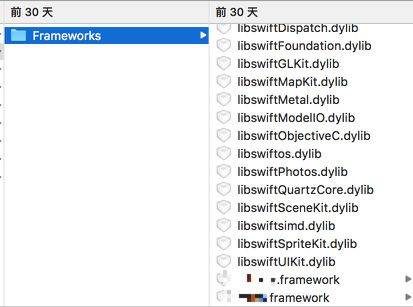
> Swift standard libraries are copied into a bundle if and only if you are building an application and this application contains Swift source files by itself. You can check whether a product such as a framework includes Swift source files by running otool -L on its executable in the Terminal. This command displays all shared libraries and frameworks that your product dynamically links against. Your product uses Swift if any of the Swift libraries appear among the result of otool -L as shown in Figure 1.  

> Embedding Content with Swift in Objective-C  

当使用 Swift 后，会自动拷贝对应的标准库（Swift ABI 稳定之前，Swift 标准库是会被自动包含的）。开启 Swift 混编后，这部分的占用大概在 8 M 左右。

这部分的优化，和之前提到的一样，主要从资源、可执行文件方面展开。

需要提两个额外的现象：

Q：为什么非系统的动态库是 framework 后缀，而不是 dylib？

> The following errors may indicate your app is embedding a dynamic library that is not packaged as a framework. Dynamic libraries outside of a framework bundle, which typically have the file extension .dylib, are not supported on iOS, watchOS, or tvOS, except for the system Swift libraries provided by Xcode.  

Embedding Frameworks In An App

故，除了系统的 Swift 库，其他的都应该打包成 framework 形式。并且不能以 libswift 开头命名。

还有一个就是，当从多架构，变成单架构支持的时候，非系统的动态库，会马上变成单架构，大小有明显的变化。而 Swift 标准库却保持不变。

那是不是意味着，Swift 标准库还保留多架构？实际上不是的，只是分发时机不同而已。

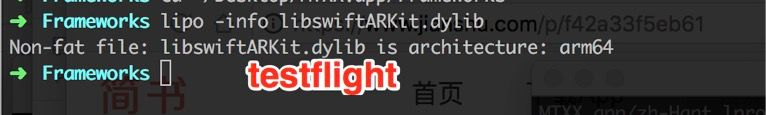
可以看到，Swift 标准库，在分发到具体设备的时候，也是单架构。

## 6. App Extension

App Extension 的占用，都放在 Plugin 文件夹内。它是独立打包签名，然后再拷贝进 Target App Bundle 的。

关于 Extension，有两个点要注意：

* 静态库最终会打包进可执行文件内部，所以如果 App Extension 依赖了三方静态库，同时主工程也引用了相同的静态库的话，最终 App 包中可能会包含两份三方静态库的体积。

* 动态库是在运行的时候才进行加载链接的，所以 Plugin 的动态库是可以和主工程共享的，把动态库的加载路径 Runpath Search Paths 修改为跟主工程一致就可以共享主工程引入的动态库。

所以，如果可能的话，把相关的依赖改成动态库方式，达到共享。

## 7. 总结

至此，常见的瘦包方式都已经介绍过了。具体的优化情况，视项目实际情况而定，没法保证哪块的优化空间就一定大。

所以，建议瘦包的时候，把这些点都过一下，总不会有错。

当然，还有其他的优化可以做。比如：

* 推动产品砍功能

* 推动第三方组件优化库（可以结合 linkmap，输出具体各个库占用的大小，有理有据）

* 模型等资源在线下载

* …

9000 多字，just enjoy it～

(晚点，抽个时间补个整体的 CheckList 图标)

## 延伸阅读

* App Thinning in Xcode
* https://developer.apple.com/videos/play/wwdc2015/404/

* Code Size Performance Guidelines
* https://developer.apple.com/library/archive/documentation/Performance/Conceptual/CodeFootprint/CodeFootprint.html

* Build settings reference
* https://help.apple.com/xcode/mac/current/#/itcaec37c2a6

* Tuning for Performance and Responsiveness
* https://developer.apple.com/library/content/documentation/General/Conceptual/MOSXAppProgrammingGuide/Performance/Performance.html#//apple_ref/doc/uid/TP40010543-CH9-SW12

* Code Size Optimization Mode in Swift 4.1
* https://swift.org/blog/osize/

* XCode 9.3 新的编译选项，优化 Swift 编译生成代码的尺寸
* https://swiftcafe.io/post/swift-optimization

* 干货|今日头条iOS端安装包大小优化—思路与实践
* https://techblog.toutiao.com/2018/06/04/gan-huo-jin-ri-tou-tiao-iosduan-an-zhuang-bao-da-xiao-you-hua-si-lu-yu-shi-jian/

* iOS可执行文件瘦身方法
* https://blog.cnbang.net/tech/2544/

* iOS 安装包瘦身
* https://sq.163yun.com/blog/article/200384401846304768

* 不改代码，Link-Time Optimization提高iOS代码效率 + 汇编代码原理分析
* https://wuwm.nuaax.com/?p=412

* iOS 瘦包常见方式梳理
* https://mp.weixin.qq.com/s/J_XYpIfDeeWJBlk9sRQMAA
 