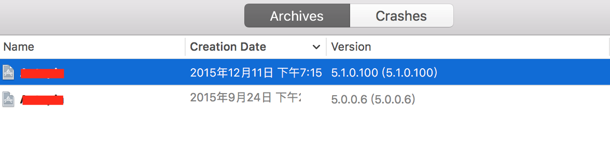
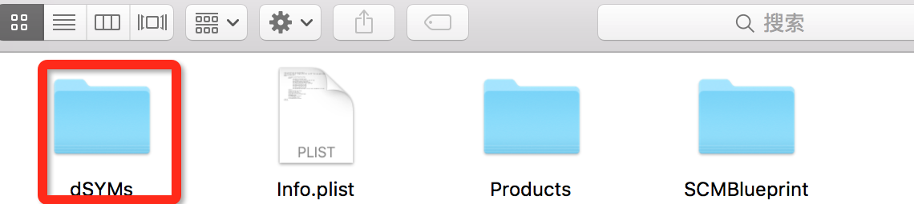
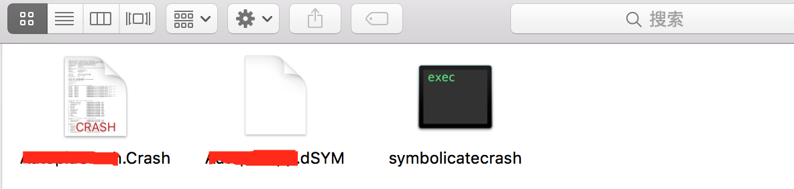
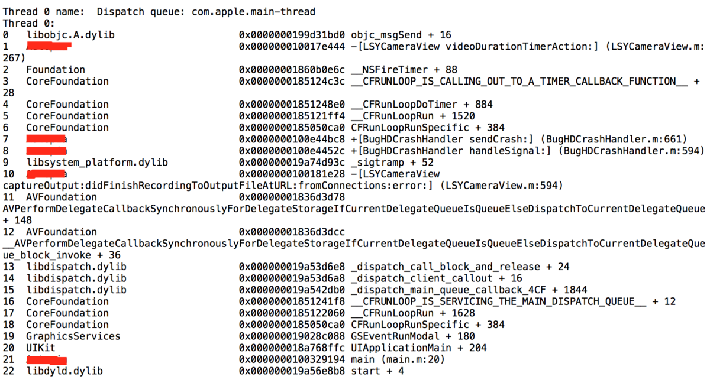
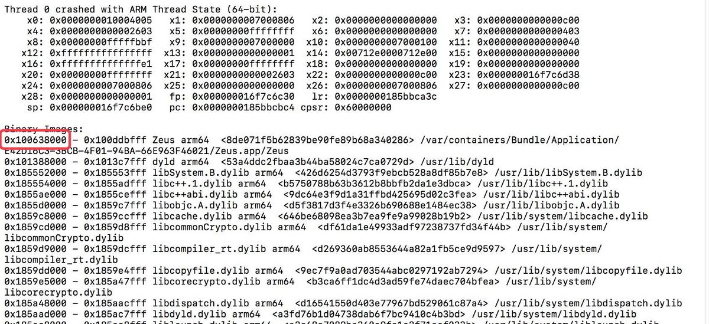
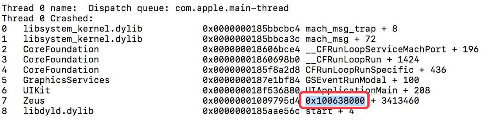
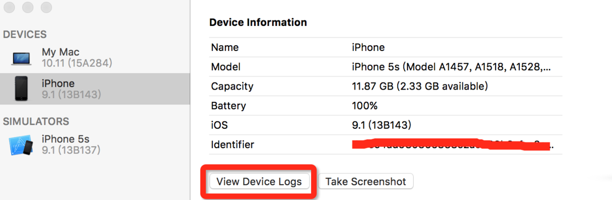
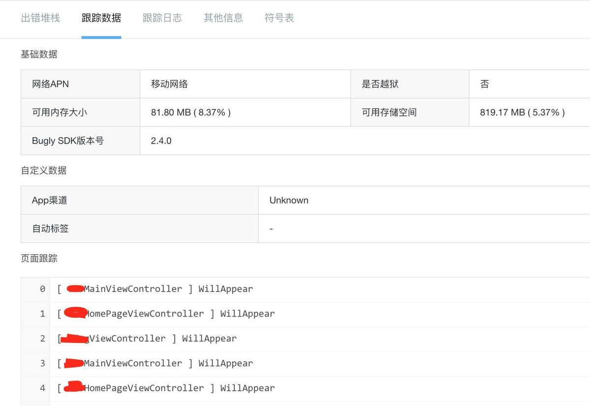
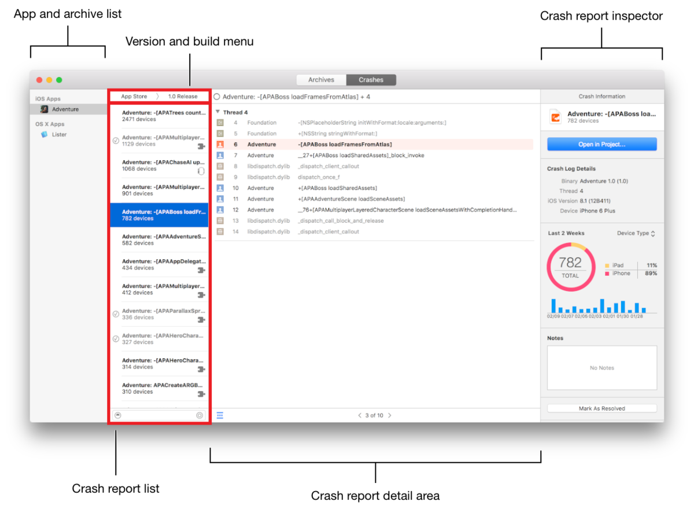

# iOS开发技巧 - 崩溃分析
[<简书 — 刘小壮>](https://www.jianshu.com/p/77660e626874)

> 在iOS开发调试过程中以及上线之后，程序经常会出现崩溃的问题。简单的崩溃还好说，复杂的崩溃就需要我们通过解析Crash文件来分析了，解析Crash文件在iOS开发中是比较常见的。  


### 获取崩溃信息

##### 获取方式

在 `iOS` 中获取崩溃信息的方式有很多，比较常见的是使用友盟、**Bugly** 等第三方分析工具，或者自己收集崩溃信息并上传公司服务器。下面列举一些我们常用的崩溃分析方式：

* 使用友盟、**Bugly** 等第三方崩溃统计工具。
* 自己实现应用内崩溃收集，并上传服务器。
* `Xcode-Devices` 中直接查看某个设备的崩溃信息。
* 使用苹果提供的 `Crash` 崩溃收集服务。

##### 收集崩溃信息

苹果给我们提供了异常处理的类- `NSException` 。这个类可以创建一个异常对象，也可以通过这个类获取一个异常对象。

这个类中最常用的是一个获取崩溃信息的 **C函数** ，可以通过这个函数在程序发生异常的时候收集这个异常。

```
// 将系统提供的获取崩溃信息函数写在这个方法中，以保证在程序开始运行就具有获取崩溃信息的功能
  - (BOOL)application:(UIApplication *)application didFinishLaunchingWithOptions:(NSDictionary *)launchOptions {
     // 将下面C函数的函数地址当做参数
     NSSetUncaughtExceptionHandler(&UncaughtExceptionHandler);
     return YES;
  }
  // 设置一个C函数，用来接收崩溃信息
  void UncaughtExceptionHandler(NSException *exception){
      // 可以通过exception对象获取一些崩溃信息，我们就是通过这些崩溃信息来进行解析的，例如下面的symbols数组就是我们的崩溃堆栈。
      NSArray *symbols = [exception callStackSymbols];
      NSString *reason = [exception reason];
      NSString *name = [exception name];
  }
```

我们也可以通过下面方法获取崩溃统计的函数指针：

```
NSUncaughtExceptionHandler *handler = NSGetUncaughtExceptionHandler();
```

### 崩溃分析

##### dSYM 符号集

进行崩溃分析，首先要弄懂一个概念，就是符号集。

* 符号集是我们对 `ipa` 文件进行打包之后，和 `.app` 文件同级的后缀名为 `.dSYM` 的文件，这个文件必须使用 **Xcode** 进行打包才有。
* 每一个.`dSYM` 文件都有一个 `UUID` ，和 `.app` 文件中的 `UUID` 对应，代表着是一个应用。而 `.dSYM` 文件中每一条崩溃信息也有一个单独的 `UUID` ，用来和程序的 `UUID` 进行校对。
* 我们如果不使用 `.dSYM` 文件解析出的崩溃信息都不能保证准确。
* 符号集中存储着文件名、方法名、行号的信息，是和可执行文件的 **16进制** 函数地址对应的，通过分析崩溃的 `.Crash` 文件可以准确知道具体的崩溃信息。

我们每次 `Archive` 一个包之后，都会随之生成一个 `dSYM` 文件。每次发布一个版本，我们都需要备份这个文件，以方便以后的调试。进行崩溃信息符号化的时候，必须使用当前应用打包的电脑所生成的 `dSYM` 文件，其他电脑生成的文件可能会导致分析不准确的问题。



当程序崩溃的时候，可以获得到崩溃的错误堆栈，错误堆栈都是 `0x` 开头的 **16进制** 地址，需要使用 **Xcode** 自带的 `symbolicatecrash` 工具来将 `.Crash` 和 `.dSYM` 文件进行符号化，就可以得到详细崩溃的信息。

##### 系统符号化文件

在崩溃分析时， `dSYM` 文件是解析 **App** 堆栈的，如果是系统库则需要对应的符号化文件。很多解析不出来系统堆栈的问题，就是因为没有系统的符号化文件。符号化文件就在 **Xcode** 的资源库里，可以从下面的目录找到符号化文件。

```
/Users/liuxiaozhuang/Library/Developer/Xcode/iOS DeviceSupport
```

符号化文件对版本和 `Architectures` 都有要求，例如崩溃的系统是 **8.4.1系统 arm64** 的指令集，就需要对应的系统符号化文件 `8.4.1 (12H321)` 。否则还是不能解析出系统崩溃信息，或者解析出来也是错的。如果在 `iOS DeviceSupport` 文件中没有找到对应的符号化文件，需要找一个对应的才可以解析。

符号化文件的指令集一般都是兼容低版本的，例如 `8.4.1 (12H321)` 的指令集会有 `arm64`、`armv7s`、`armv7` 三个版本，如果苹果没有明确说明某个 `iOS` 版本不兼容 **32位** 处理器，那么指令集都会兼容的。

搜集系统符号化文件非常困难，我在国外也没找到搜集全的网站。但是国内有一个非常敬业的 `iOS` 同行，搜集总结了 `iOS7` - `iOS10` 的很多符号化文件，而且作者对文件做了优化，下载下来的文件也不会很大， **非常感谢他！**

```
网盘链接: https://pan.baidu.com/s/1nvfi4g5
密码: 79m8
```

这里的符号化文件也并不全，如果遇到没有找到的符号化文件，到崩溃日志中找到 `OS Version：iOS 8.4.1 (12H321)` ，把后面的系统 `build` 版本放在 `Google` 搜一下试试，如果搜不到就不太好解决了。

##### symbolicatecrash工具

通过 **Mac** 自带的命令行工具解析 `Crash` 文件需要具备四个文件

* `symbolicatecrash` ， **Xcode** 自带的崩溃分析工具，使用这个工具可以更精确的定位崩溃所在的位置，将 **0x** 开头的地址替换为响应的代码和具体行数。
* 打包时产生的 `dSYM` 文件。
* 崩溃时产生的 `Crash` 文件。
* 对应 `iOS` 系统和指令集的 **符号化文件** 。

我在解析崩溃信息的时候，一般会在桌面上单独建立一个 `Crash` 文件夹，然后将 `.Crash`、`.dSYM`、`symbolicatecrash` 放在这个文件夹中，这样进入这个文件夹下，直接一行命令就解决了。下次再做崩溃分析的时候，换一下对应的文件名就可以解析。

`symbolicatecrash` 在 **Xcode8** 及之后是下面的路径。

```
/Applications/Xcode.app/Contents/SharedFrameworks/DVTFoundation.framework/Versions/A/Resources/symbolicatecrash
```

**Xcode8** 之前 `symbolicatecrash` 在下面的路径中。

```
/Applications/Xcode.app/Contents/SharedFrameworks/DTDeviceKitBase.framework/Versions/A/Resources/symbolicatecrash
```

然后 `Window -> Organizer -> Archives` 中，选中 `archive` 的版本右击，选择 `Show in Finder` 就可以获取 `dSYM` 文件了。



将 `.Crash`、`.dSYM`、`symbolicatecrash` 三个文件都放在我们在桌面建立的 `Crash` 文件夹中。



开启命令行工具，进入崩溃文件夹中

```
cd /Users/username/Desktop/崩溃文件夹
```

使用命令解析Crash文件

```
./symbolicatecrash ./*.crash ./*.app.dSYM > symbol.crash
```

如果上面命令不成功，使用命令检查一下环境变量

```
xcode-select -print-path
```

返回结果：

```
/Applications/Xcode.app/Contents/Developer/
```

如果不是上面的结果，需要使用下面命令设置一下导出的环境变量，然后重复上面解析的操作。

```
export DEVELOPER_DIR=/Applications/XCode.app/Contents/Developer
```

解析完成后会生成一个新的 `.Crash` 文件，这个文件中就是崩溃详细信息。图中红色标注的部分就是我们代码崩溃的部分。



注意，以下情况不会有崩溃信息产生：

* 内存访问错误(不是野指针错误， `bad memory` 错误)
* 低内存，当程序内存使用过多会造成系统低内存的问题，系统会将程序内存回收
* 因为某种原因触发看门狗机制

##### atos命令

有时候通过 `symbolicatecrash` 并不能解析出来崩溃信息，或者 **App** 自身的堆栈能解析出来，但是系统堆栈解析不出来，这在解析过程中是经常遇到的。

可以通过 `atos` 命令进行逐行解析，通过这个命令可以解析指定的某一行堆栈。并且这个命令是不需要 `dSYM` 的，可以在没有 `dSYM` 的情况下使用。

在讲 `atos` 之前先对一些基本知识了解一下。

`architecture` 是指令集类型，例如 `arm64`、`armv7s` 之类的。可以在 **Xcode** 的 `Build Settings` 中查看，也可以执行下面命令查看二进制文件支持的指令集。

```
lipo -info 二进制名
```

会输出下面信息，根据崩溃设备机型选择对应的指令集类型。

```
Architectures in the fat file: 二进制名 are: armv7 arm64
```

`loadAddress` 是 `Binary Images` 中对应的二进制首地址，每个动态库和二进制都有自己的首地址， 对应崩溃堆栈的首地址。



在每条崩溃堆栈中，都有对应的首地址和地址偏移。例如 **Zeus** 这个二进制对应的就是 `Binary Images` 的 `Zeus arm64` 的首地址，根据这个首地址加上后面的地址偏移，就是函数所在的函数地址。



以上面崩溃堆栈为例， `atos` 命令格式

```
atos -arch arm64 -o Zeus -l 0x10063000 0x00000001009795d4
```

通过这个命令可以解析出具体的崩溃信息

```
-[FocusView updateImageViews] (in Zeus) (FocusView.m:119)
```

如果是系统堆栈，则需要把二进制名 **Zeus** 换成对应的 `framework` 或 `dylib` 名。拿 `Foundation` 举例来说，为了命令看起来简单点，我先把 `8.4.1 (12H321)` 中的 `Foundation.framework` 拷贝到和 **Zeus** 统计目录下，然后执行下面命令即可， `dylib` 同理。

```
atos -arch arm64 Foundation.framework/Foundation -l 0x1830bc000 0x0000000183109f94
```

然后就输出了 `Foundation` 内部的堆栈信息。

```
-[NSURL(NSURLPathUtilities) URLByAppendingPathComponent:] (in Foundation) + 144
```

##### 注意点

1.需要注意的是，文中提到的 `dSYM`、**符号化文件**、`App` 二进制，都需要和当前崩溃设备的 `App` 版本、`iOS` 系统版本、`Architectures` 指令集对应，地址偏移也不要写错，否则会导致解析出来的堆栈不正确。

```
atos -arch arm64 -o Zeus -l 0x10063000 0x000000010092b52a
```

例如上面命令解析的堆栈如下

```
-[DetailHeaderView layoutSubviews] (in Zeus) (DetailHeaderView.m:34)
```

但是我用其他版本的二进制解析，同样的命令，解析结果可能就不一样。

```
-[ShareManager manager] (in Zeus) (ShareManager.m:194)
```

所以崩溃信息中最上面的一些参数就很重要，包含了我们需要的 `iOS` 版本、`App build` 号、指令集类型等信息。

2.无论是 `App` 的堆栈还是系统堆栈，如果使用系统自带的 `symbolicatecrash` 和 `atos` 两种方式不能解析，都是因为没有对应的 `dSYM` 或二进制、符号化文件。

如果手里有对应的设备，第一次插入电脑后连接 **Xcode** ，会显示 `Processing symbol files` 。这个过程就是拷贝符号化文件到 `iOS DeviceSupport` 目录的过程，拷贝完成后就可以拿到符号化文件了。

### 崩溃统计工具

##### 通过Xcode查看设备崩溃信息

除了上面的系统分析工具来进行分析，也可以将发生崩溃的设备连接 **Xcode** ，选择 `window－> devices －> 选择自己的手机 -> view device logs` 就可以查看手机上所有的崩溃信息了。



只要手机上的应用是这台电脑安装打包的，这样的崩溃信息系统已经为我们符号化好了，只需要进去之后等一会就行(不要相信这里面的进度刷新，并不准确，亲测….)。如果还是没有符号化完毕 ，可以选择文件，然后右击选择 `Re-Sysbomlicate` 就可以。 

如果是使用其他电脑进行的打包，可以在这里面将 `Crash` 文件导出，自己通过命令行的方式进行解析。

##### 第三方崩溃分析工具

现在有很多第三方工具都可以进行崩溃统计分析，使用比较多的是友盟崩溃统计，友盟崩溃统计被集成在友盟 **SDK** 中，具体用法可以直接看 [官方文档](https://links.jianshu.com/go?to=http%3A%2F%2Fdev.umeng.com%2Fanalytics%2Freports%2Ferrors%232) ，这里不多做叙述。

但是我并不推荐友盟，而是推荐一个非常强大的崩溃统计工具— [Bugly](https://links.jianshu.com/go?to=https%3A%2F%2Fbugly.qq.com%2Fv2%2Findex) ，我公司项目也在使用 **Bugly** 。它最大的优势在于，可以直接将崩溃信息分析出来并且做好分类和汇总，而且一些我们自己分析不出来或很难分析出来的崩溃， **Bugly** 都能分析出来。当然需要提前上传 `dSYM` 到 **Bugly** 后台，否则可能会导致一些崩溃分析不出来。


这是 **Bugly** 统计的崩溃分布，可以选择版本、时间之类的。而且 **Bugly** 不仅限于崩溃统计，还有卡顿分析和错误分析，我感觉这两个也比较实用。相对友盟或者其他崩溃分析工具， **Bugly** 是一个轻量级的崩溃统计工具。



出错堆栈 **Bugly** 会帮我们解析好，并且会根据不同情况给一些解决建议，这个我就不截图了。

**Bugly** 有一个页面追踪功能，这是我认为非常有用的一个功能。这个功能会将用户在不同页面之间跳转的流程记录下来。这样对于复现 `bug` 是很有用的，可以根据用户页面跳转推测出用户大概操作流程，根据这个流程复现 `bug` 。


**Bugly** 还有日报功能，可以每天汇总一篇日报，并且发到团队每个人的邮箱和微信号上。我认为这个功能非常实用，每天大概八九点上班路上，掏出手机看一下微信上 **Bugly** 日报，想一下项目哪可能有问题，到公司正好解决 `bug` 。

##### 苹果自带崩溃统计工具

苹果在 **Xcode** 中为我们集成了崩溃统计功能，在 `Window -> Organizer -> Crashes` 中可以看到。



苹果自带的崩溃统计工具并不推荐用，如果想要使用这个功能，需要用户在 **iPhone** 中进行设置 `设置 -> 隐私 -> 诊断与用量 -> 诊断与用量数据(iOS8以下在通用中设置)` 选择自动发送，并与开发者共享。

然而很多人并不想和开发者共享数据，或者不设置这个选项，那这样就收集不到这部分的崩溃。

##### 第三方工具恶意覆盖

崩溃收集统计函数应该只进行一次调用，如果用第三方的话也最好只用一个第三方，这样获取崩溃统计信息的途径也是唯一的。第三方统计工具并不是用的越多越好，使用多个崩溃收集第三方会导致 `NSSetUncaughtExceptionHandler()` 函数指针的恶意覆盖，导致有些第三方不能收到崩溃信息。

现在很多第三方崩溃收集工具为了确保自己能最大可能的收集到崩溃信息，会对 `NSSetUncaughtExceptionHandler()` 函数指针的恶意覆盖。因为这个函数是将函数地址当做参数传递，所以只要重复调用就会被覆盖，这样就不能保证崩溃收集的稳定性。

[iOS开发技巧 - 崩溃分析](https://www.jianshu.com/p/77660e626874)