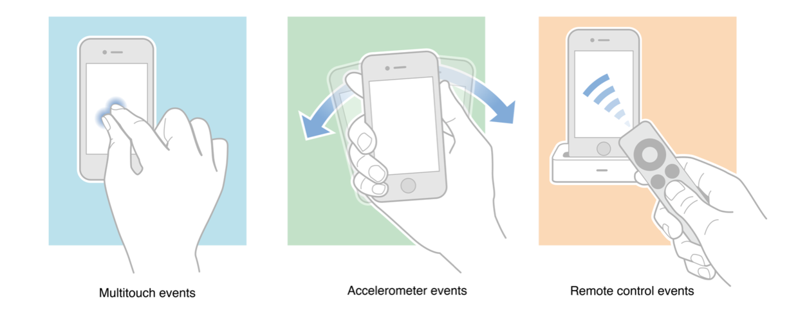
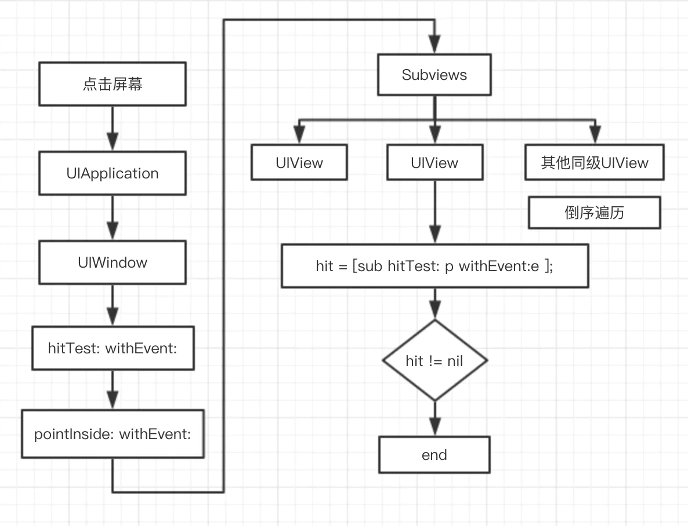
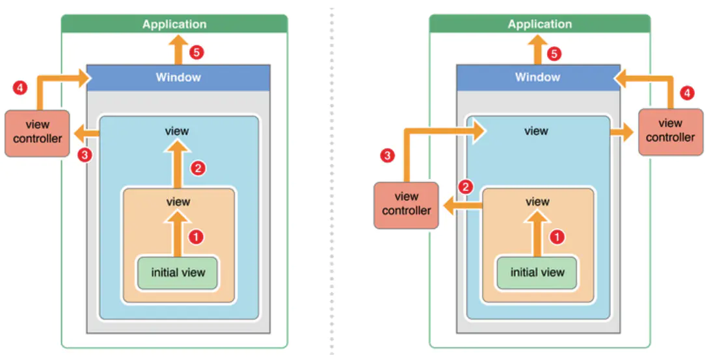
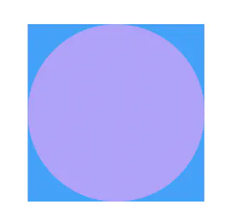

# iOS响应者链

iOS中的响应者链（Responder Chain）是用于确定事件响应者的一种机制，其中的事件主要指触摸事件（Touch Event），该机制和UIKit中的UIResponder类紧密相关。响应触摸事件的都是屏幕上的界面元素，而且必须是继承自UIResponser类的界面类（包括各种常见的视图类及其视图控制器类，如UIView和UIViewController）才可以响应触摸事件。

## iOS中的事件

iOS系统操作设备的方式主要有三种：触摸屏幕、晃动设备、通过遥控设施控制设备。

对应的事件类型有以三种：1、触屏事件（Touch Event）2、运动事件（Motion Event）3、远端控制事件（Remote-Control Event）



UIResponder中提供的事件处理方法。

```
//Touch Event
- (void)touchesBegan:(NSSet *)touches withEvent:(UIEvent *)event;
- (void)touchesMoved:(NSSet *)touches withEvent:(UIEvent *)event;
- (void)touchesEnded:(NSSet *)touches withEvent:(UIEvent *)event;
- (void)touchesCancelled:(NSSet *)touches withEvent:(UIEvent *)event;
//Motion Event
- (void)motionBegan:(UIEventSubtype)motion withEvent:(UIEvent *)event;
- (void)motionEnded:(UIEventSubtype)motion withEvent:(UIEvent *)event;
- (void)motionCancelled:(UIEventSubtype)motion withEvent:(UIEvent *)event;
//Remote-Control Event
- (void)remoteControlReceivedWithEvent:(UIEvent *)event;
```

这里只讨论触屏事件。

## 响应者

当我们触控手机屏幕时系统便会将这一操作封装成一个UIEvent放到事件队列里面，然后Application从事件队列取出这个事件，接着需要找到去响应这个事件的最佳视图也就是Responder, 所以开始的第一步应该是找到Responder。 

事件传递的流程图



那么又是如何找到的呢？那就不得不引出UIView的2个方法：

```
//返回视图层级中能响应触控点的最深视图
-(UIView *)hitTest:(CGPoint)point withEvent:(UIEvent *)event
//返回视图是否包含指定的某个点
-(BOOL)pointInside:(CGPoint)point withEvent:(UIEvent *)event
```

* 我们点击屏幕产生触摸事件，系统将这个事件加入到一个由UIApplication管理的事件队列中，UIApplication会从消息队列里取事件分发下去，首先传给UIWindow
* 在UIWindow中就会调用hitTest:withEvent:方法去返回一个最终响应的视图
* 在hitTest:withEvent:方法中就会去调用pointInside: withEvent:去判断当前点击的point是否在UIWindow范围内，如果是的话，就会去遍历它的子视图来查找最终响应的子视图
* 遍历的方式是使用倒序的方式来遍历子视图(后添加的子视图先显示，减少遍历次数)，也就是说最后添加的子视图会最先遍历，在每一个视图中都会去调用它的hitTest:withEvent:方法
* 最终会返回一个响应视图，如果返回视图有值，那么这个视图就作为最终响应视图，结束整个事件传递；如果没有值，那么就会将UIWindow作为响应者

## 处理者

响应者链流程图（箭头指向nextResponder）



响应者链的事件传递过程总结如下:

* 如果view的控制器存在，就传递给控制器处理；如果控制器不存在，则传递给它的父视图，将在视图层次结构的最顶层，如果也不能处理收到的事件，则将事件传递给UIWindow对象进行处理
* 如果UIWindow对象也不处理，则将事件传递给UIApplication对象
* 如果UIApplication也不能处理该事件，则将该事件丢弃


能够处理UI事件都是继承UIResponder的子类对象，UIResponder主要有以下4个方法来处理事件：

```
- (void)touchesBegan:(NSSet<UITouch *> *)touches withEvent:(nullable UIEvent *)event;
- (void)touchesMoved:(NSSet<UITouch *> *)touches withEvent:(nullable UIEvent *)event;
- (void)touchesEnded:(NSSet<UITouch *> *)touches withEvent:(nullable UIEvent *)event;
- (void)touchesCancelled:(NSSet<UITouch *> *)touches withEvent:(nullable UIEvent *)event;
```

分别是对应从触摸事件的开始、移动、结束、取消，如果你想自定义响应事件可以重写这几个方法来实现。如果某个Responder没处理事件，事件会被传递，UIResponder都有一个nextResponder属性，此属性会返回在Responder Chain中的下一个事件处理者，如果每个Responder都不处理事件，那么事件将会被丢弃。所以继承自UIResponder的子类便会构成一条响应者链，所以我们可以打印下以View3为开始的响应者链是什么样的：

```
//必须放在viewDidAppear中执行，不然部分nextResponder为空
- (void)viewDidAppear:(BOOL)animated {
    [super viewDidAppear:animated];
    UIResponder *nextResponder = self.view3.nextResponder;
    NSMutableString *pre = [NSMutableString stringWithString:@"-"];
    NSLog(@"%@",NSStringFromClass([self.view3 class]));
    while (nextResponder) {
        NSLog(@"%@%@", pre, NSStringFromClass([nextResponder class]));
        [pre appendString:@"-"];
        nextResponder = nextResponder.nextResponder;
    }
}
```

```
//层级关系:UIWindow-(rootVC)->UINavigationController-(rootVC)->IFXResponderChainVC.view-(addSubView)->IFXView2-(addSubView)->IFXView3

2020-06-16 17:30:20.747597+0800 IFXProgram[83661:1437823] IFXView3
2020-06-16 17:30:20.747802+0800 IFXProgram[83661:1437823] -IFXView2
2020-06-16 17:30:20.747968+0800 IFXProgram[83661:1437823] --UIView
2020-06-16 17:30:20.748424+0800 IFXProgram[83661:1437823] ---IFXResponderChainVC
2020-06-16 17:30:20.748606+0800 IFXProgram[83661:1437823] ----UIViewControllerWrapperView
2020-06-16 17:30:20.748745+0800 IFXProgram[83661:1437823] -----UINavigationTransitionView
2020-06-16 17:30:20.748904+0800 IFXProgram[83661:1437823] ------UILayoutContainerView
2020-06-16 17:30:20.749049+0800 IFXProgram[83661:1437823] -------UINavigationController
2020-06-16 17:30:20.749849+0800 IFXProgram[83661:1437823] --------UIDropShadowView
2020-06-16 17:30:20.750007+0800 IFXProgram[83661:1437823] ---------UITransitionView
2020-06-16 17:30:20.751257+0800 IFXProgram[83661:1437823] ----------UIWindow
2020-06-16 17:30:20.751452+0800 IFXProgram[83661:1437823] -----------UIWindowScene
2020-06-16 17:30:20.751591+0800 IFXProgram[83661:1437823] ------------UIApplication
2020-06-16 17:30:20.751726+0800 IFXProgram[83661:1437823] -------------AppDelegate
```

```
//层级关系:UIWindow-(rootVC)->UINavigationController-(rootVC)->ViewController.view-(addSubView)->IFXResponderChainVC.view-(self.view addSubView)->IFXView2-(addSubView)->IFXView3

2020-06-16 17:45:19.805592+0800 IFXProgram[84924:1449157] IFXView3
2020-06-16 17:45:19.805799+0800 IFXProgram[84924:1449157] -IFXView2
2020-06-16 17:45:19.805948+0800 IFXProgram[84924:1449157] --UIView
2020-06-16 17:45:19.807058+0800 IFXProgram[84924:1449157] ---IFXResponderChainVC
2020-06-16 17:45:19.807612+0800 IFXProgram[84924:1449157] ----UIView
2020-06-16 17:45:19.808190+0800 IFXProgram[84924:1449157] -----ViewController
2020-06-16 17:45:19.808367+0800 IFXProgram[84924:1449157] ------UIViewControllerWrapperView
2020-06-16 17:45:19.808564+0800 IFXProgram[84924:1449157] -------UINavigationTransitionView
2020-06-16 17:45:19.809419+0800 IFXProgram[84924:1449157] --------UILayoutContainerView
2020-06-16 17:45:19.809854+0800 IFXProgram[84924:1449157] ---------UINavigationController
2020-06-16 17:45:19.810087+0800 IFXProgram[84924:1449157] ----------UIDropShadowView
2020-06-16 17:45:19.810548+0800 IFXProgram[84924:1449157] -----------UITransitionView
2020-06-16 17:45:19.811020+0800 IFXProgram[84924:1449157] ------------UIWindow
2020-06-16 17:45:19.811491+0800 IFXProgram[84924:1449157] -------------UIWindowScene
2020-06-16 17:45:19.812676+0800 IFXProgram[84924:1449157] --------------UIApplication
2020-06-16 17:45:19.813272+0800 IFXProgram[84924:1449157] ---------------AppDelegate
```

为了验证点击上面的事件的处理顺序，在基类View重写这几个方法：

```
- (void)touchesBegan:(NSSet<UITouch *> *)touches withEvent:(UIEvent *)event {
    NSLog(@"%@ touchesBegan", NSStringFromClass([self class]));
    [super touchesBegan:touches withEvent:event];
}

- (void)touchesMoved:(NSSet<UITouch *> *)touches withEvent:(UIEvent *)event {
    NSLog(@"%@ touchesMoved", NSStringFromClass([self class]));
    [super touchesMoved:touches withEvent:event];
}

- (void)touchesEnded:(NSSet<UITouch *> *)touches withEvent:(UIEvent *)event {
    NSLog(@"%@ touchesEnded", NSStringFromClass([self class]));
    [super touchesEnded:touches withEvent:event];
}
```

同样也为控制器添(IFXResponderChainVC)加相关touches方法，日志打印看调用顺序：

```
2020-06-16 18:05:31.852814+0800 IFXProgram[86599:1463313] IFXView3 touchesBegan
2020-06-16 18:05:31.853018+0800 IFXProgram[86599:1463313] IFXView2 touchesBegan
2020-06-16 18:05:31.853199+0800 IFXProgram[86599:1463313] IFXResponderChainVC touchesBegan
2020-06-16 18:05:31.897063+0800 IFXProgram[86599:1463313] IFXView3 touchesEnded
2020-06-16 18:05:31.897338+0800 IFXProgram[86599:1463313] IFXView2 touchesEnded
2020-06-16 18:05:31.897531+0800 IFXProgram[86599:1463313] IFXResponderChainVC touchesEnded
```

可以看到先是由UIWindow通过hitTest返回所找到的最合适的响应者View3, 接着执行了View3的touchesBegan，然后是通过nextResponder依次是View2、IFXResponderChainVC,可以看到完全是按照nextResponder链条的调用顺序，touchesEnded也是同样的顺序。

上面是View3不处理点击事件的情况，接下来我们为View3添加一个点击事件处理，看看又会是什么样的调用过程：

```
@implementation IFXView3

- (instancetype)initWithFrame:(CGRect)frame {
    if (self = [super initWithFrame:frame]) {
        [self addGestureRecognizer:[[UITapGestureRecognizer alloc] initWithTarget:self action:@selector(tapAction:)]];
    }
    return self;
}

- (void)tapAction:(UITapGestureRecognizer *)recognizer {
    NSLog(@"%@ taped",NSStringFromClass([self class]));
}

@end
```

运行程序，点击View3看看日志打印：

```
2020-06-16 18:12:38.834807+0800 IFXProgram[87240:1469846] IFXView3 touchesBegan
2020-06-16 18:12:38.835043+0800 IFXProgram[87240:1469846] IFXView2 touchesBegan
2020-06-16 18:12:38.835230+0800 IFXProgram[87240:1469846] IFXResponderChainVC touchesBegan
```

可以看到touchesBegan顺着nextResponder链条调用了，但是View3处理了事件，去执行了相关是事件处理方法，而touchesEnded并没有得到调用。

可以看出：

1. 找到最适合的响应视图后事件会从此视图开始沿着响应链nextResponder传递，直到找到处理事件的视图,如果没有处理的事件会被丢弃。
2. 如果将视图控制器（VC）的View添加到父视图（superView）上，VC.view的nextResponder是VC，VC的nextResponder是superView

## 无法响应的情况

UIView不接受事件处理的情况有:

1. alpha <0.01
2. userInteractionEnabled = NO
3. hidden ＝ YES

## 改变响应者链的示例

在一个方形按钮中点击中间的圆形区域有效，而点击四角无效
e'map
核心思想是在pointInside: withEvent:方法中修改对应的区域



```
- (UIView *)hitTest:(CGPoint)point withEvent:(UIEvent *)event {
    // 如果控件不允许与用用户交互,那么返回nil
    if (!self.userInteractionEnabled || [self isHidden] || self.alpha <= 0.01) {
        return nil;
    }

    //判断当前视图是否在点击范围内
    if ([self pointInside:point withEvent:event]) {
        //遍历当前对象的子视图(倒序)
        __block UIView *hit = nil;
        [self.subviews enumerateObjectsWithOptions:NSEnumerationReverse usingBlock:^(__kindof UIView * _Nonnull obj, NSUInteger idx, BOOL * _Nonnull stop) {
            //坐标转换，把当前坐标系上的点转换成子控件坐标系上的点
            CGPoint convertPoint = [self convertPoint:point toView:obj];
            //调用子视图的hitTest方法，判断自己的子控件是不是最适合的View
            hit = [obj hitTest:convertPoint withEvent:event];
            //如果找到了就停止遍历
            if (hit) *stop = YES;
        }];

        //返回当前的视图对象
        return hit?hit:self;
    }else {
        return nil;
    }
}

// 该方法判断触摸点是否在控件身上，是则返回YES，否则返回NO，point参数必须是方法调用者的坐标系
- (BOOL)pointInside:(CGPoint)point withEvent:(UIEvent *)event {   
    CGFloat x1 = point.x;
    CGFloat y1 = point.y;
    
    CGFloat x2 = self.frame.size.width / 2;
    CGFloat y2 = self.frame.size.height / 2;
    
    //判断是否在圆形区域内
    double dis = sqrt((x1 - x2) * (x1 - x2) + (y1 - y2) * (y1 - y2));
    if (dis <= self.frame.size.width / 2) {
        return YES;
    }
    else{
        return NO;
    }
}
```