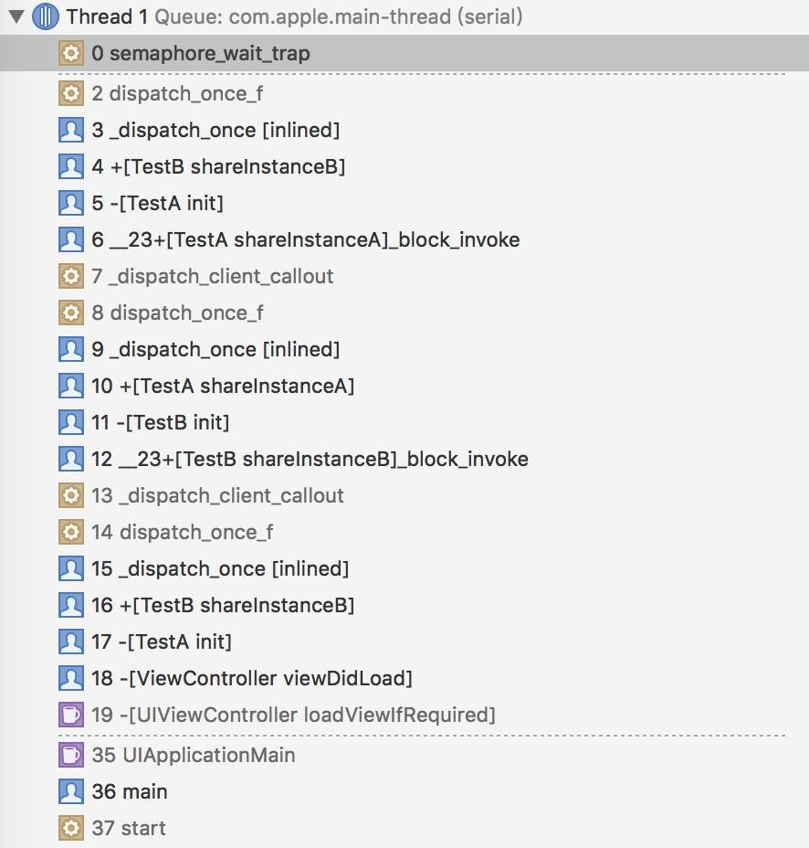

# 滥用单例dispatch_once而造成的死锁问题

在开发中使用单例是最经常不过的事儿了，最常用的就是dispatch_once这个函数，这个函数可以使其参数内的block块只在全局执行一次从而达到目的，不过这个函数要是用的稍微“巧”了的话，就会出问题。比如看下面这段代码：

```objc
#import "TestA.h"
@implementation TestA

+(TestA *)shareInstanceA
{
    static TestA *testa = nil;
    static dispatch_once_t token;

    dispatch_once(&token, ^{

        testa = [[TestA alloc]init];
    });

    return testa;
}

-(instancetype)init
{
    self = [super init];

    if (self) {

        [TestB shareInstanceB];
    }

    return self;
}

@end

@implementation TestB

+(TestB *)shareInstanceB
{
    static TestB *testb = nil;
    static dispatch_once_t token;

    dispatch_once(&token, ^{

        testb = [[TestB alloc]init];
});

return testb;
}

-(instancetype)init
{
    self = [super init];

    if(self)
    {
        [TestA shareInstanceA];
    }

    return self;
}

@end
```

>一般产生死锁都是因为在dispatch_once的block中调用了dispatch_once

在viewDidload里面创建TestA的对象，猜猜结果会怎样？卡死了，直接不动了，造成死锁了（我等了30秒还是没动静……）。这个情况曾经在帮同学查问题的时候遇见过一次。现在暂停程序，查看调用栈的状态如下图所示：



发现这么几个函数调用的很频繁： `dispatch_once_f` 和 `shareInstanceA` 和 `shareInstanceB` ，而且在栈顶部的函数是 `semaphore_wait_trap` 和 `dispatch_once_f` ，程序最后是在 `dispatch_once_f` 卡死的,在这儿出现的问题，那么这个函数有巨大的怀疑，然后就想办法搞到这个函数的源码，因为GCD部分是开源的，可以找到代码，寻找途径一： [http://libdispatch.macosforge.org/trac/browser#tags/libdispatch-200/src](https://link.jianshu.com?t=http://libdispatch.macosforge.org/trac/browser#tags/libdispatch-200/src) ，在这个路径下，有一个once.c的文件，里面就有此函数的代码。路径二：在git bash中输入命令：git clone [git://git.macosforge.org/libdispatch.git](https://link.jianshu.com?t=git://git.macosforge.org/libdispatch.git) ，在下载下来的文件中找到src文件夹下的once.c文件。现在就看看就看看它的内部实现吧，为了后面的内容所提及的代码，也把once.h文件的代码放到下面了，由于这个文件的代码不多，放到第一部分：
once.h的代码：

```objc
#ifndef __DISPATCH_ONCE__
#define __DISPATCH_ONCE__

#ifndef __DISPATCH_INDIRECT__
#error "Please #include <dispatch/dispatch.h> instead of this file directly."
#include <dispatch/base.h> // for HeaderDoc
#endif

__BEGIN_DECLS

/*!
 * @typedef dispatch_once_t
 *
 * @abstract
 * A predicate for use with dispatch_once(). It must be initialized to zero.
 * Note: static and global variables default to zero.
 */
typedef long dispatch_once_t;

/*!
 * @function dispatch_once
 *
 * @abstract
 * Execute a block once and only once.
 *
 * @param predicate
 * A pointer to a dispatch_once_t that is used to test whether the block has
 * completed or not.
 *
 * @param block
 * The block to execute once.
 *
 * @discussion
 * Always call dispatch_once() before using or testing any variables that are
 * initialized by the block.
 */
#ifdef __BLOCKS__
__OSX_AVAILABLE_STARTING(__MAC_10_6,__IPHONE_4_0)
DISPATCH_EXPORT DISPATCH_NONNULL_ALL DISPATCH_NOTHROW
void
dispatch_once(dispatch_once_t *predicate, dispatch_block_t block);

//注意这个内联函数
DISPATCH_INLINE DISPATCH_ALWAYS_INLINE DISPATCH_NONNULL_ALL DISPATCH_NOTHROW
void
_dispatch_once(dispatch_once_t *predicate, dispatch_block_t block)
{
    if (DISPATCH_EXPECT(*predicate, ~0l) != ~0l) {
        dispatch_once(predicate, block);
    }
}
#undef dispatch_once
#define dispatch_once _dispatch_once
#endif

__OSX_AVAILABLE_STARTING(__MAC_10_6,__IPHONE_4_0)
DISPATCH_EXPORT DISPATCH_NONNULL1 DISPATCH_NONNULL3 DISPATCH_NOTHROW
void
dispatch_once_f(dispatch_once_t *predicate, void *context,
        dispatch_function_t function);

DISPATCH_INLINE DISPATCH_ALWAYS_INLINE DISPATCH_NONNULL1 DISPATCH_NONNULL3
DISPATCH_NOTHROW
void
_dispatch_once_f(dispatch_once_t *predicate, void *context,
        dispatch_function_t function)
{
    if (DISPATCH_EXPECT(*predicate, ~0l) != ~0l) {
        dispatch_once_f(predicate, context, function);
    }
}
#undef dispatch_once_f
#define dispatch_once_f _dispatch_once_f

__END_DECLS

#endif
```

现在要提前补习一点知识。来看上面那些代码的大概意思：

### 大体意思

看那个内联函数的注释，这其实是 `dispatch_once` 读取端的实现，对应还有写入端（后面有提到）， `DISPATCH_EXPECT` 函数是告诉cpu `*predicate的` 值等于 ~0l 是很有可能的判定结果，DISPATCH_EXPECT展开就是 `__builtin_expect((x), (v))` ，它是GCC引进的宏，其作用就是帮助编译器判断条件跳转的预期值，避免跳转造成时间浪费。并没有改变其对真值的判断。主要目的就是增加效率，降低 **负载** ，为什么要降低负载呢，原因如下。

#### 原因

先来看dispatch_once的三个使用时的所在场景：

1. 第一次执行，block需要调用，调用结束后要改变标记量
2. 不是第一次执行，并且这时候步骤1中的没执行完，当前线程需要等待步骤1的完成
3. 不是第一次执行，但是这时候步骤1执行结束，当前线程跳过block执行后续的任务

对于场景1，性能瓶颈在于block所执行的任务，而不在 `dispatch_once` 函数本身。场景2，发生的几率不大，即时遇到这种情况，只需等待前面的线程执行结束就可。场景3，则可能经常遇到，前面的dispatch_once一旦执行结束，后面所有的线程遇到了之后都是场景3的情况。

dispatch_once本意是只执行一次就结束它的使命，具有一次性，一旦执行结束后，它就没意义了，希望后面的任务在执行中基本不会受其影响，一旦有大的影响，就会造成性能负担，因此 **希望它尽可能降低对后续调用的负载** 。那么多大影响才算“较小”的影响，这需要一个基准线，这个基准线就是非线程安全的纯if判断语句，而 `dispatch_once` 确实接近这个基准值。

#### 解决办法

那么要采取什么办法解决这个问题呢，在翻阅一大堆外文资料、博客、翻译后，发现这里面涉及到一些关于CPU的知识：

>**cpu的分支预测和预执行**

流水线特性使得CPU能更快地执行线性指令序列，但是当遇到条件判断分支时，麻烦来了，在判定语句返回结果之前，cpu不知道该执行哪个分支，那就得等着（术语叫做pipeline stall），所以，CPU会进行预执行推理，cpu先猜测一个可能的分支，然后开始执 行分支中的指令。现代CPU一般都能做到超过90%的猜测命中率。然后当判定语句返回，如果cpu猜错分支，那么之前进行的执行都会被抛弃，然后从正确的分支重新开始执行（在once.c文件里的源代码注释里提到之）。
在dispatch_once中，唯一一个判断分支就是predicate，dispatch_once会让CPU预先执行条件不成立的分支，这样可以大大提升函数执行速度（在once.c文件里的源代码注释里提到之）。但是这样的预执行导致的结果是使用了未初始化的obj并将函数返回，这显然不是预期结果。

>**不对称barrier**

编写barrier时，应该是对称的，在写入端，要有一个barrier来保证顺序写入，同时，在读取端，也要有一个barrier来保证顺序读取。但是，我们的dispatch_once实现要求写入端快不快无所谓，而读取端尽可能的快。所以，我们要解决前述的预执行引起的问题。 当一个预执行最终被发现是错误的猜测时，所有的预执行状态以及结果都会被清除，然后cpu会从判断分支处重新执行正确的分支，也就意味着被读取的未初始化的obj也会被抛弃，然后读取。假如dispatch_once能做到在执行完block并正确赋值给obj后，告诉其它cpu核心：刚才都猜错了！然后cpu就会重新从分支处开始执行，进而获取正确的obj值并返回。

从最早的预执行到条件判断语句最终结果被计算出来，这之间有很长时间（记作Ta），具体多长取决于cpu的设计，但是不论如何，这个时间最多几十圈cpu时钟时间（在once.c文件里的源代码注释里提到之），假如写入端能在【初始化并写入obj】与【置predicate值】之间等待足够长的时间Tb使得Tb大于等于Ta，那问题就都解决了。

> 如果觉得这个”解决”难以理解，那么反过来思考，假如Tb小于Ta，那么Tb就有可能被Ta完全包含，也就是说，另一个线程B（耗时为Ta）在预执行读取了未初始化的obj值之后，回过头来确认猜测正确性时，predicate可能被执行block的线程A置为了“完成”，这就导致线程B认为自己的预执行有效（实际上它读取了未初始化的值）。而假如Tb大于等于Ta，任何读取了未初始化的obj值的预执行都会被判定为未命中，从而进入内层dispatch_once而进行等待。  

> 要保证足够的等待时间，需要一些trick。在intel的CPU上，dispatch_once动用了cpuid指令来达成这个目的。cpuid本来是用作取得cpu的信息，但是这个指令也同时强制将指令流串行化，并且这个指令是需要比较长的执行时间的（在某些cpu上，甚至需要几百圈cpu时钟），这个时间Tb足够超过Ta了。  

### 接着大体意思继续看

`DISPATCH_EXPECT` 函数的作用是使得CPU在猜测上有更大的几率提高正确率，猜测到正确的分支，最重要的是，这一句是个简单的if判定语句，负载无限接近 **基准值** 。到此，读取端的介绍完毕。

这是once.c的代码

```objc
#include "internal.h"

#undef dispatch_once
#undef dispatch_once_f

struct _dispatch_once_waiter_s 
{
    volatile struct _dispatch_once_waiter_s *volatile dow_next;
    _dispatch_thread_semaphore_t dow_sema;
};

#define DISPATCH_ONCE_DONE ((struct _dispatch_once_waiter_s *)~0l)

#ifdef __BLOCKS__

// 1.应用程序调用的入口
void
dispatch_once(dispatch_once_t *val, dispatch_block_t block)
{
    struct Block_basic *bb = (void *)block;

    // 2. 内部逻辑
    dispatch_once_f(val, block, (void *)bb->Block_invoke);
}
#endif

DISPATCH_NOINLINE
void
dispatch_once_f(dispatch_once_t *val, void *ctxt, dispatch_function_t func)
{
    struct _dispatch_once_waiter_s * volatile *vval =
        (struct _dispatch_once_waiter_s**)val;

    // 3. 类似于简单的哨兵位
    struct _dispatch_once_waiter_s dow = { NULL, 0 };

    // 4. 在Dispatch_Once的block执行期进入的dispatch_once_t更改请求的链表
    struct _dispatch_once_waiter_s *tail, *tmp;

    // 5.局部变量，用于在遍历链表过程中获取每一个在链表上的更改请求的信号量
    _dispatch_thread_semaphore_t sema;

    // 6. Compare and Swap（用于首次更改请求）
    if (dispatch_atomic_cmpxchg(vval, NULL, &dow)) 
    {
        dispatch_atomic_acquire_barrier();

        // 7.调用dispatch_once的block
        _dispatch_client_callout(ctxt, func);

    // The next barrier must be long and strong.
    //
    // The scenario: SMP systems with weakly ordered memory models
    // and aggressive out-of-order instruction execution.
    //
    // The problem:
    //
    // The dispatch_once*() wrapper macro causes the callee's
    // instruction stream to look like this (pseudo-RISC):
    //
    //      load r5, pred-addr
    //      cmpi r5, -1
    //      beq  1f
    //      call dispatch_once*()
    //      1f:
    //      load r6, data-addr
    //
    // May be re-ordered like so:
    //
    //      load r6, data-addr
    //      load r5, pred-addr
    //      cmpi r5, -1
    //      beq  1f
    //      call dispatch_once*()
    //      1f:
    //
    // Normally, a barrier on the read side is used to workaround
    // the weakly ordered memory model. But barriers are expensive
    // and we only need to synchronize once! After func(ctxt)
    // completes, the predicate will be marked as "done" and the
    // branch predictor will correctly skip the call to
    // dispatch_once*().
    //
    // A far faster alternative solution: Defeat the speculative
    // read-ahead of peer CPUs.
    //
    // Modern architectures will throw away speculative results
    // once a branch mis-prediction occurs. Therefore, if we can
    // ensure that the predicate is not marked as being complete
    // until long after the last store by func(ctxt), then we have
    // defeated the read-ahead of peer CPUs.
    //
    // In other words, the last "store" by func(ctxt) must complete
    // and then N cycles must elapse before ~0l is stored to *val.
    // The value of N is whatever is sufficient to defeat the
    // read-ahead mechanism of peer CPUs.
    //
    // On some CPUs, the most fully synchronizing instruction might
    // need to be issued.

        //在写入端，dispatch_once在执行了block之后，会调用dispatch_atomic_maximally_synchronizing_barrier()
        //宏函数，在intel处理器上，这个函数编译出的是cpuid指令。

        dispatch_atomic_maximally_synchronizing_barrier();

        //dispatch_atomic_release_barrier(); // assumed contained in above

        // 8. 更改请求成为DISPATCH_ONCE_DONE(原子性的操作)
        tmp = dispatch_atomic_xchg(vval, DISPATCH_ONCE_DONE);

        tail = &dow;

        // 9. 发现还有更改请求，继续遍历
        while (tail != tmp) 
        {
            // 10. 如果这个时候tmp的next指针还没更新完毕，就等待一会，提示cpu减少额外处理，提升性能，节省电力。
            while (!tmp->dow_next) 
            {
                _dispatch_hardware_pause();
            }

            // 11. 取出当前的信号量，告诉等待者，这次更改请求完成了，轮到下一个了
            sema = tmp->dow_sema;

            tmp = (struct _dispatch_once_waiter_s*)tmp->dow_next;

            _dispatch_thread_semaphore_signal(sema);
        }
    } else 
    {    
        // 12. 非首次请求，进入此逻辑块
        dow.dow_sema = _dispatch_get_thread_semaphore();

        // 13. 遍历每一个后续请求，如果状态已经是Done，直接进行下一个
        // 同时该状态检测还用于避免在后续wait之前，信号量已经发出(signal)造成
        // 的死锁
        for (;;) 
        {
            tmp = *vval;
            if (tmp == DISPATCH_ONCE_DONE) 
            {
                break;
            }
            dispatch_atomic_store_barrier();

            // 14. 如果当前dispatch_once执行的block没有结束，那么就将这些
            // 后续请求添加到链表当中
            if (dispatch_atomic_cmpxchg(vval, tmp, &dow))
            {
                dow.dow_next = tmp;
                _dispatch_thread_semaphore_wait(dow.dow_sema);
            }
        }
        _dispatch_put_thread_semaphore(dow.dow_sema);
    }
}
```

一堆宏函数和一堆线程同步代码，看的头大……结合前面提到的和源代码注释一点一点的看：

1. `dispatch_once` 函数的里面其实是调用了 `dispatch_once_f` 函数，而f的意思是C函数（没有带f的是调用了block），但是block最终还是调用了C函数。当调用了 `dispatch_once_f` 函数的时候， `val` 是外部传入的 `predicate` ， `ctxt` 指的是外部传入的block的指针， `func` 是block里的具体执行体函数，执行 `func` 就是执行block。

2. 接着声明了一堆变量， `vval` 是volatile标记了的 `val` ，volatile修饰符的意思大概是告诉编译器：这个指针所指向的值，可能随时会被其他线程所改变，使编译器不再对此指针进行代码编译优化。dow意为 `dispatch_once_wait` 。

3. `dispatch_atomic_cmpxchg` 是“原子比较交换函数” `__sync_bool_compare_and_swap` 的宏替换，然后进入 **分支1:执行block分支** ，当 `dispatch_once` 第一次执行时， `predicate` 也就是 `val` 的值为0，这时候“原子比较交换函数”将返回true并且把 `vval` 的值赋为 `&dow` ，意为“等待中”， `_dispatch_client_callout` 的内部会做一些判断，但实际上调用了 `func` 函数，到此block中的用户代码执行结束。

4. 接下来就是 `dispatch_atomic_maximally_synchronizing_barrier` 函数，这是个宏函数，这个函数编译过后成为了 *cpuid* 指令，它的作用可以让其他线程读取到未初始化的对象 *欲执行猜测* 能被判断为“猜测未命中”，从而可以使这些线程进入 `dispatch_once_f` 的另外一个分支（else分支）进行等待。完成后，使用 `dispatch_atomic_xchg` 进行赋值，使其为 `DISPATCH_ONCE_DONE` ，即“完成”。

5. 接着是对信号量链表的处理，分两种情况：1，block执行过程中，没有其他线程进入本函数来等待，则 `vval` 指向值保持为 `&dow` ，即 `tmp` 被赋值为 `&dow` ，即下方while循环不会被执行，此分支结束。2，在block执行过程中，有其他线程进入本函数来等待，那么会构造一个信号量链表（ `vval` 指向值变为信号量链的头部，链表的尾部为 `&dow` ），此时就会进入while循环，在此while循环中，遍历链表，逐个 `signal` 每个信号量，然后结束循环。 `while (!tmp->dow_next)` 此循环是等待在 `&dow` 上的，因为 **线程等待分支2** 会中途将val赋值为&dow，然后为dow_next赋值，这期间dow_next值为NULL，所以需要等待，下面是 **线程等待分支2** 的描述：

6. 当 **执行block分支1** 还没有完成，而且有新的线程进入到本函数，则进入线程等待分支，首先调用 `_dispatch_get_thread_semaphore` 函数创建一个信号量，此信号量被赋值给 `dow.dow_sema` 。然后进入一个无限for循环，假如发现 `vval` 的指向值已经为 `DISPATCH_ONCE_DONE` ，即“完成”，则直接break，然后调用 `_dispatch_put_thread_semaphore` 函数销毁信号量并退出函数。假如vval的值并非 `DISPATCH_ONCE_DONE` ，则进行一个“原子比较并交换”操作（此操作可以避免两个等待线程同时操作链表带来的问题），假如此时 `vval` 指向值已不再是 `tmp` （这种情况发生在多个线程同时进入线程 **等待分支2** ，并交错修改链表）则for循环重新开始，再尝试重新获取一次 `vval` 来进行同样的操作；若指向值还是 `tmp` ，则将 `vval` 的指向值赋值为 `&dow` ，此时 `val->dow_next值为NULL` ，可能会使得block执行 **分支1** 进行while等待（如前述），紧接着执行 `dow.dow_next = tmp` 这句来增加链表节点（同时也使得block执行 **分支1** 的while等待结束），然后等待在信号量上，当block执行 **分支1** 完成并遍历链表来signal时，唤醒、释放信号量，然后一切就完成了。

通过看实现代码，大致可以知道dispatch_once是这样的过程：

* 线程A执行block时，其它线程都需要等待。
* 线程A执行完block应该立即标记任务为完成状态，然后遍历信号量链来唤醒所有等待线程。
* 线程A遍历信号量链来signal时，任何其他新进入函数的线程都应该直接返回而无需等待。
* 线程A遍历信号量链来signal时，若有其它等待线程B仍在更新或试图更新信号量链表，应该保证线程B能正确完成其任务：a.直接返回 b.等待在信号量上并很快又被唤醒。
* 线程B构造信号量时，应该考虑线程A随时可能改变状态（等待、完成、遍历信号量链表）。
* 线程B构造信号量时，应该考虑到另一个线程C也可能正在更新或试图更新信号量链，应该保证B、C都能正常完成其任务：a.增加链节并等待在信号量上 b.发现线程A已经标记“完成”然后直接销毁信号量并退出函数。

总结：

* `dispatch_once` 不是只执行一次那么简单。内部还是很复杂的。onceToken在第一次执行block之前，它的值由NULL变为指向第一个调用者的指针(&dow)。
* `dispatch_once` 是可以接受多次请求的，内部会构造一个链表来维护之。如果在block完成之前，有其它的调用者进来，则会把这些调用者放到一个waiter链表中（在else分支中的代码）。
* waiter链表中的每个调用者会等待一个信号量(dow.dow_sema)。在block执行完了后，除了将onceToken置为DISPATCH_ONCE_DONE外，还会去遍历waiter链中的所有waiter，抛出相应的信号量，以告知waiter们调用已经结束了。
* 两个类相互调用其单例方法时，调用者TestA作为一个waiter，在等待TestB中的block完成，而TestB中block的完成依赖于TestA中单例函数的block的执行完成，而TestA中的block想要完成还需要TestB中的block完成……两个人都在相互等待对方的完成，这就成了一个死锁。如果在 `dispatch_once` 函数的block块执行期间，循环进入自己的 `dispatch_once` 函数，会造成链表一直增长，同样也会造成死锁。（这里只是简单的A->B->A->B->A这样的循环，也可以是A->A->A这样的更加直接的循环，但如果是A->B->C->A->B->C->A这样的复杂链状循环的话，是很难直观判断出是否有循环的。如果隐含更加复杂的循环链，天晓得会出现在哪儿）。

[滥用单例dispatch_once而造成的死锁问题](https://www.jianshu.com/p/f4e38d06fa04)